# 区块链浏览器
作者：长安链团队 魏宁洲、凌风

## 概述

区块链浏览器提供了实时浏览、查询区块链信息和统计信息的功能。主要由前端（`Web`展示）、后端及数据库三部分组成。数据库采用的是`MySQL`，后端采用go语言开发，前端使用的是`react`框架。

## 安装指南
### 环境依赖
**docker**

`docker`版本为`20.10.7`或以上

```sh
# 以centos7为例，其他安装方式见下方官网
$ sudo yum remove docker docker-client docker-client-latest docker-common docker-latest docker-latest-logrotate docker-logrotate docker-engine
$ sudo yum install -y yum-utils
$ sudo yum-config-manager --add-repo https://download.docker.com/linux/centos/docker-ce.repo
$ sudo yum install docker-ce docker-ce-cli containerd.io docker-compose-plugin
```


`docker-compose`版本为`1.29.2`或以上

```sh
# 以centos7为例，其他安装方式见下方官网
$ sudo curl -L "https://github.com/docker/compose/releases/download/1.29.2/docker-compose-$(uname -s)-$(uname -m)" -o /usr/local/bin/docker-compose
$ sudo chmod +x /usr/local/bin/docker-compose
```


下载地址：
   - [https://docs.docker.com/engine/install/](https://docs.docker.com/engine/install/)
   - [https://docs.docker.com/compose/install/](https://docs.docker.com/compose/install/)

若已安装，请通过命令查看版本：

```bash
$ docker -v
$ docker-compose -v
```

### 浏览器部署

#### 前置环境

浏览器部署需要依赖一个`ChainMaker`运行环境。具体的`ChainMaker`环境安装部署请参考对应的文档[通过命令行体验链](../quickstart/通过命令行体验链.md)。

#### 代码下载

下载地址： https://git.chainmaker.org.cn/chainmaker/chainmaker-explorer

代码版本：v2.2.0

下载代码：

```bash
$ git clone https://git.chainmaker.org.cn/chainmaker/chainmaker-explorer.git
```

#### 启动运行

##### 启动docker

```shell
$ make docker-compose-start
# 或者
$ cd docker && docker-compose up -d
```

##### 查看日志

```sh
$ docker logs -f --tail 200 docker_cm_explorer_server_1
```

##### 访问地址

```
http://localhost:9996
```


#### 配置调整

浏览器配置文件：`configs/config.yml`，它的配置内容包括四部分，以下是详细说明：

```yml
web:
  address: 0.0.0.0
  # 监听端口
  port: 9997
  # 是否跨域
  cross_domain: true

node:
  #  链和节点更新时间
  update_time 30
  #  节点断开连接时间和新增链时间
  sync_time: 30

# mysql配置信息
db:
  host: cm_explorer_db
  port: 3306
  database: chainmaker_explorer_dev
  user:   chainmaker
  passwd: Baec&chainmaker
```


## 使用手册

### 初始化

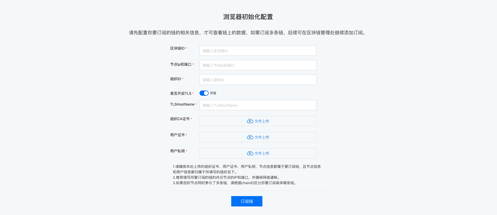

- 初始化时，需要先订阅一条链，请确保所填写的信息和要订阅的链是一致的，并且用来订阅的节点的网络连接是通畅的。
- 如需订阅多条链，后续可在区块链管理处继续添加订阅。
- 参数说明
  - 区块链ID：使用命令行创建的链默认链ID为chain1
  - 节点ip和端口：ip为部署链的机器ip，port使用对应节点的rpc地址，一般默认为12301
  - 组织ID：可以从每个节点对应的配置文件chainmaker.yml(`chainamaker-go/build/config/chainmaker.yml`)获取
  - TLS：请根据您的链的实际情况，选择是否开启TLS。目前通过官方开源文档教程上起的链，默认TLS(路径:`chainamaker-go/build/config/chainmaker.yml对应的参数net.tls.enabled`)是开启的，默认的TLSHostname为chainmaker.org，如您自定义修改过，请按照实际情况填写。
  - 组织ca证书：根据选择的组织id，从对应的节点中拿到对应组织下的ca.crt(eg:组织id为wx-org1.chainmaker.org的证书路径`chainamaker-go/build/config/node1/wx-org1.chainmaker.org/ca.crt`)
  - 用户证书、私钥：需要使用sign证书和私钥，一般默认使用admin.sign.crt和admin.sign.key(路径：`chainamaker-go/build/config/node1/user/`)


### 首页

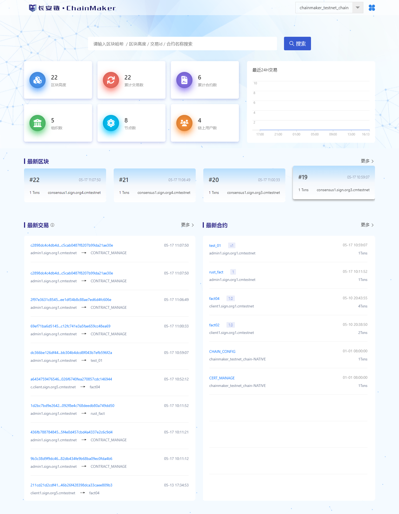


- 通过右上角可以切换跳转到已经订阅的其他链的浏览器页面，也可继续添加订阅链。
- 支持通过区块哈希/区块高度/交易id/合约名称直接搜索。
- 点击左下角统计当前链的相关数据，如区块高度，交易数等，点击将跳转到对应的区块列表页、交易列表页、合约列表页、组织列表页、节点列表页、账户列表页等。
- 首页将展示当前最新的区块信息，包含每个区块的区块高度、包含交易数、出块节点。
- 首页将展示当前最新的区块信息，包含每笔交易的交易id、交易发起者、所调用的合约以及交易发起时间。
- 首页将展示当前最新的区块信息，包含每个合约的合约名称、合约创建者、合约版本、合约部署时间。


### 订阅区块链

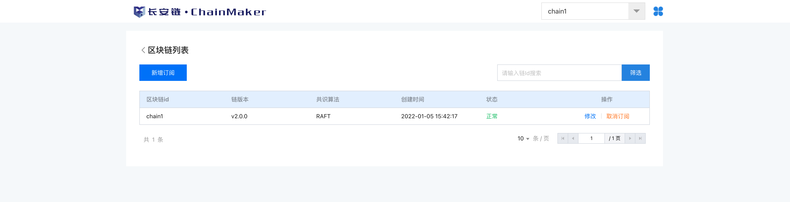
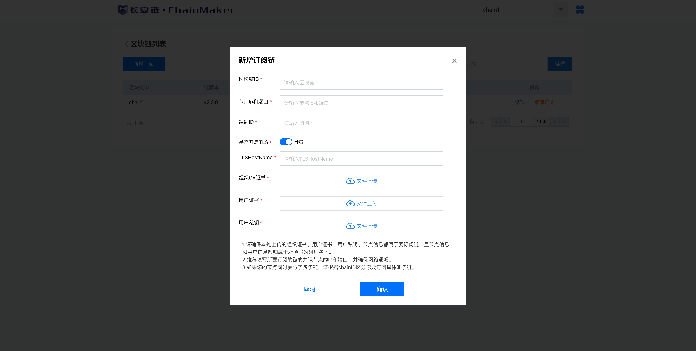

- 支持同时订阅多条链，再订阅链时，请确保所填写的信息和要订阅的链是一致的，并且用来订阅的节点的网络连接是通畅的。
- 不允许同时订阅同一条链。
- 如果订阅后，所订阅的节点运行出现异常，如停机了，或者被踢出网络了，则浏览器也将无法获取信息，您可以通过修改订阅信息，修改正常运行的节点，恢复订阅。
-  支持取消订阅，取消后，将不会再获取该链的信息，如需获取，需要重新订阅。

### 区块信息

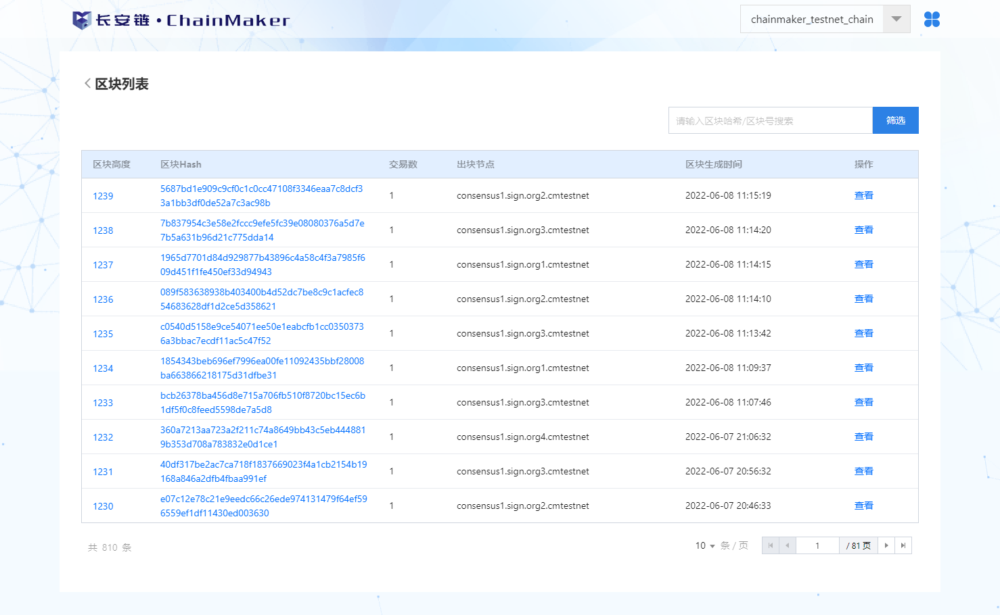

- 此处展示区块列表，点击查看，可以查看该区块的详情。

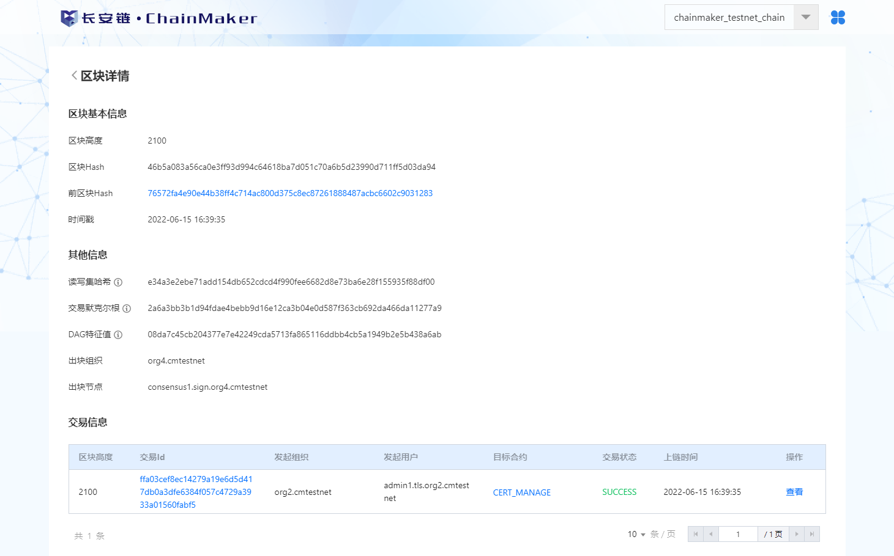

- 支持查看某一区块的具体信息，包括区块哈希，读写集哈希，DAG信息，以及本区块内的交易信息。

### 交易信息

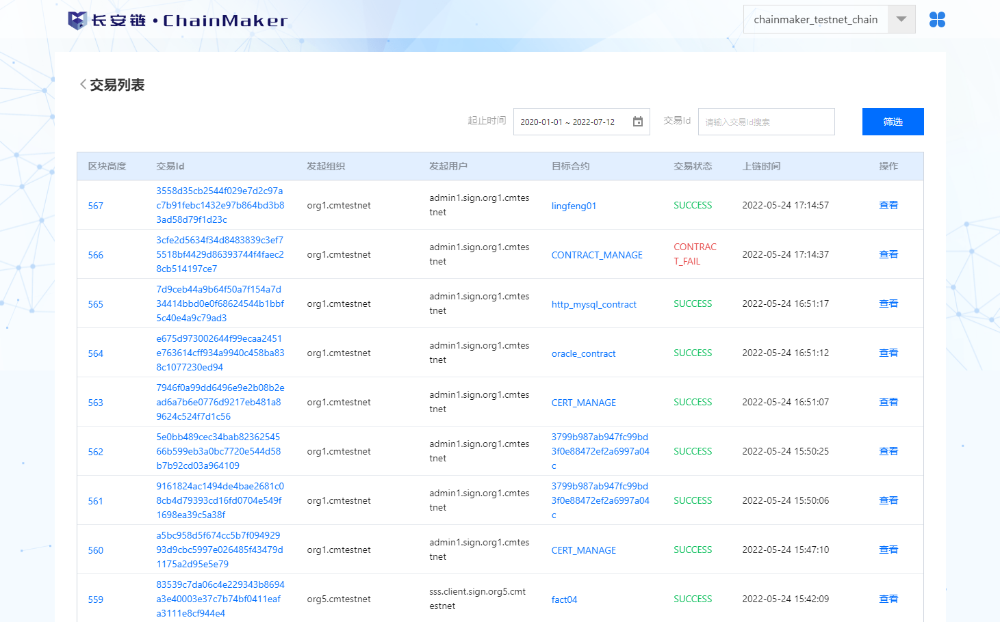

- 此处展示交易列表，支持通过实际时间维度筛选交易，点击查看，可以查看该交易的详情。

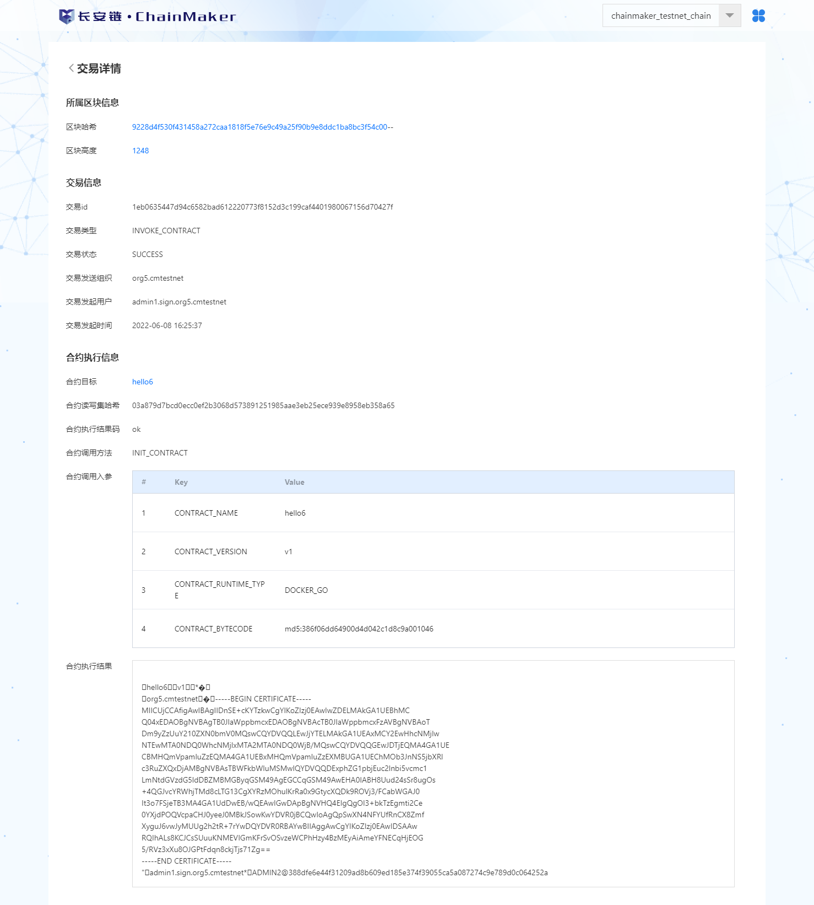

- 支持查看某一条交易详情，包括交易的所属区块信息，交易发起人信息，交易所调用的合约执行情况。

### 合约信息

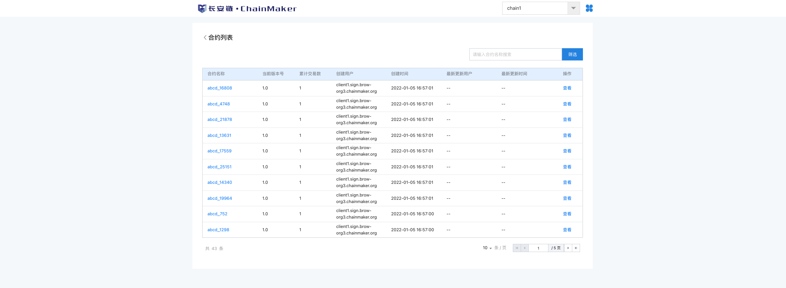

- 此处展示合约列表，点击查看，可以查看该合约的详情。

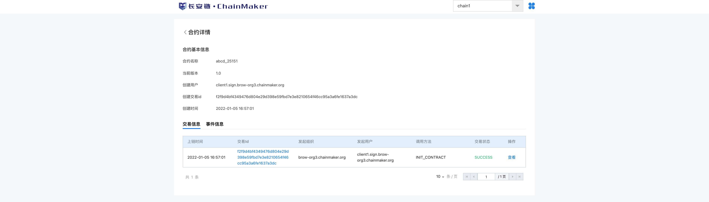

- 支持查看合约信息，包括合约的创建者信息，以及合约调用的历史交易记录。
- 支持查看合约调用过程中，产生的事件信息。

### 组织信息

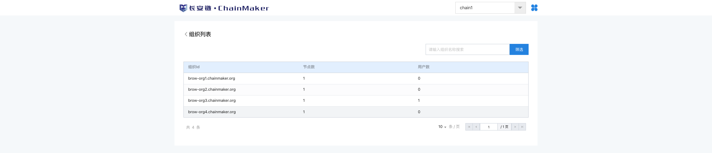

- 此处展示参与该区块链的组织信息。

### 节点信息

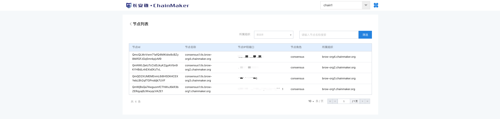

- 此处展示参与该区块链的节点信息。

### 链账户信息

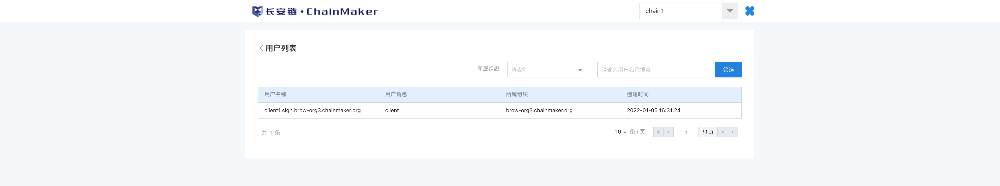

- 此处展示该区块链目前已经发送过或者接收过交易的用户信息。

### 部署新版浏览器步骤

1. 停止旧版浏览器：在旧版本项目`chainmaker-explorer/docker`目录下执行：`docker-compose down -v`，注意有个后缀-v，删除所有数据；
2. 按照上方教程启动新版浏览器；
3. 重新订阅所需要的链；