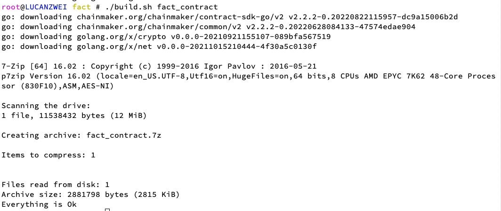

# 使用Golang进行智能合约开发
作者：长安链团队 韩天乐、魏宁洲、卢光宏、李腾辉

读者对象：本章节主要描述使用Golang进行ChainMaker合约编写的方法，主要面向于使用Golang进行ChainMaker的合约开发的开发者。

## 环境依赖

1. 操作系统

	目前仅支持在Linux系统下部署和运行 Docker VM，合约的编译也必须在Linux环境下执行。如果需要在其他系统环境下编译合约，请参考Golang的交叉编译修改编译命令。

2. 软件依赖

	推荐使用Goland 或 vscode等IDE编写和编译Golang合约。

	编译后的合约需要经过7zip压缩形成最终的合约文件，7zip的安装请参看[7zip官网](https://sparanoid.com/lab/7z/)

3. 长安链环境准备

	准备一条支持Docker_VM的长安链，以及长安链CMC工具，用于将写编写好的合约，部署到链上进行测试。相关安装教程请详见：

	- [部署支持Docker_VM的长安链教程。](./启动支持Docker_VM的链.md)
	- [部署长安链CMC工具的教程。](../dev/命令行工具.md)


## 编写Golang合约

### 通过go.mod引用合约SDK

ChainMaker官方Golang合约SDK支持通过go.mod的方式引用，可直接使用go get引用，示例如下：

   ```shell
   $ go get chainmaker.org.cn/chainmaker/contract-sdk-go/v2@v2.3.0
   ```


执行完成后，即可参考下文的编写合约注意事项，调用合约sdk的方法，编写合约。


### 编写合约注意事项

1. 代码入口包名必须为`main`

2. 代码入口

   ```go
   package main
   
   // sdk代码中，有且仅有一个main()方法
   func main() {  
      // main()方法中，下面的代码为必须代码，不建议修改main()方法当中的代码
      // 其中，TestContract为用户实现合约的具体名称
   	err := sandbox.Start(new(FactContract))
   	if err != nil {
   		log.Fatal(err)
   	}
   }
   ```

3. 合约必要代码

	```go
	// 合约结构体，合约名称需要写入main()方法当中
	type FactContract struct {
	}

   // 合约必须实现下面两个方法：
   // InitContract() protogo.Response
   // UpgradeContract() protogo.Response
   // InvokeContract(method string) protogo.Response
   
   // 用于合约的部署
   // @return: 	合约返回结果，包括Success和Error
   func (f *FactContract) InitContract() protogo.Response {
   	return sdk.Success([]byte("Init contract success"))
   }
   
   // 用于合约的升级
   // @return: 	合约返回结果，包括Success和Error
   func (f *FactContract) UpgradeContract() protogo.Response {
   	return sdk.Success([]byte("Upgrade contract success"))
   }
   
   // 用于合约的调用
   // @param method: 交易请求调用的方法
   // @return: 	合约返回结果，包括Success和Error
   func (f *FactContract) InvokeContract(method string) protogo.Response {
		switch method {
		case "save":
			return f.save()
		case "findByFileHash":
			return f.findByFileHash()
		default:
			return sdk.Error("invalid method")
		}
	}
	```


### 合约SDK接口描述

长安链提供golang合约与链交互的相关接口，写合约时可直接导入包，并进行引用，具体信息可参考文章末尾"接口描述章节"。


### 编译合约
当合约编写完成后，则需要编译合约，具体教程如下

#### 使用脚本编译合约
1. 在合约工程中添加如下编译脚本搭建编译环境。

	```shell
	#!/bin/bash

	contractName=$1
	if  [[ ! -n $contractName ]] ;then
		echo "contractName is empty. use as: ./build.sh contractName"
		exit 1
	fi

	go build -ldflags="-s -w" -o $contractName

	7z a $contractName $contractName
	rm -f $contractName

	```

2. 编译撰写好的智能合约。

	其中ContractName请替换成需要安装的合约名称 

	```shell
	./build.sh ContractName
	```

	编译成功，如下图所示：

	

#### 手动编译合约


需要保证是在Linux环境下编译，在此文件夹的当前路径执行如下编译命令：

```shell
# 如果需要在其他系统环境下编译合约，请参考Golang的交叉编译修改go build命令。
go build -ldflags="-s -w" -o file_name

7z a file_name file_name
```

在编译合约时，首先使用golang编译程序。

编译后使用7zip对编译好的可执行文件进行压缩。

编译结果输出与使用脚本编译一致。

### 部署调用合约

编译完成后，将得到一个`.7z`格式的合约文件，可将之部署到指定到长安链上，完成合约部署。
部署合约的使用教程可详见：[部署示例合约](./部署示例合约.md)。


## 示例合约使用演示

### 示例代码说明

ChainMaker官方提供了通过go.mod引用合约SDK进行合约开发的示例合约工程。

以存证合约为例，可以直接下载下编译存证合约，过程如下：
   ```shell
   $ git clone https://git.chainmaker.org.cn/chainmaker/contracts-go.git
   $ cd contracts-go/fact
   $ ./build.sh fact
   ...
   ```

更多合约示例可以直接查看仓库[contracts-go](https://git.chainmaker.org.cn/chainmaker/contracts-go)


### 存证合约示例源码展示

```go
/*
Copyright (C) BABEC. All rights reserved.
Copyright (C) THL A29 Limited, a Tencent company. All rights reserved.

SPDX-License-Identifier: Apache-2.0
*/

package main

import (
	"encoding/json"
	"fmt"
	"log"
	"strconv"

	"chainmaker.org/chainmaker/contract-sdk-go/v2/pb/protogo"
	"chainmaker.org/chainmaker/contract-sdk-go/v2/sandbox"
	"chainmaker.org/chainmaker/contract-sdk-go/v2/sdk"
)

type FactContract struct {
}

// 存证对象
type Fact struct {
	FileHash string `json:"fileHash"`
	FileName string `json:"fileName"`
	Time     int32  `json:"time"`
}

// 新建存证对象
func NewFact(fileHash string, fileName string, time int32) *Fact {
	fact := &Fact{
		FileHash: fileHash,
		FileName: fileName,
		Time:     time,
	}
	return fact
}

func (f *FactContract) InitContract() protogo.Response {
	return sdk.Success([]byte("Init contract success"))
}

func (f *FactContract) UpgradeContract() protogo.Response {
	return sdk.Success([]byte("Upgrade contract success"))
}

func (f *FactContract) InvokeContract(method string) protogo.Response {
	switch method {
	case "save":
		return f.save()
	case "findByFileHash":
		return f.findByFileHash()
	default:
		return sdk.Error("invalid method")
	}
}

func (f *FactContract) save() protogo.Response {
	params := sdk.Instance.GetArgs()

	// 获取参数
	fileHash := string(params["file_hash"])
	fileName := string(params["file_name"])
	timeStr := string(params["time"])
	time, err := strconv.Atoi(timeStr)
	if err != nil {
		msg := "time is [" + timeStr + "] not int"
		sdk.Instance.Errorf(msg)
		return sdk.Error(msg)
	}

	// 构建结构体
	fact := NewFact(fileHash, fileName, int32(time))

	// 序列化
	factBytes, err := json.Marshal(fact)
	if err != nil {
		return sdk.Error(fmt.Sprintf("marshal fact failed, err: %s", err))
	}
	// 发送事件
	sdk.Instance.EmitEvent("topic_vx", []string{fact.FileHash, fact.FileName})

	// 存储数据
	err = sdk.Instance.PutStateByte("fact_bytes", fact.FileHash, factBytes)
	if err != nil {
		return sdk.Error("fail to save fact bytes")
	}

	// 记录日志
	sdk.Instance.Infof("[save] fileHash=" + fact.FileHash)
	sdk.Instance.Infof("[save] fileName=" + fact.FileName)

	// 返回结果
	return sdk.Success([]byte(fact.FileName + fact.FileHash))

}

func (f *FactContract) findByFileHash() protogo.Response {
	// 获取参数
	fileHash := string(sdk.Instance.GetArgs()["file_hash"])

	// 查询结果
	result, err := sdk.Instance.GetStateByte("fact_bytes", fileHash)
	if err != nil {
		return sdk.Error("failed to call get_state")
	}

	// 反序列化
	var fact Fact
	if err = json.Unmarshal(result, &fact); err != nil {
		return sdk.Error(fmt.Sprintf("unmarshal fact failed, err: %s", err))
	}

	// 记录日志
	sdk.Instance.Infof("[find_by_file_hash] fileHash=" + fact.FileHash)
	sdk.Instance.Infof("[find_by_file_hash] fileName=" + fact.FileName)

	// 返回结果
	return sdk.Success(result)
}

func main() {
	err := sandbox.Start(new(FactContract))
	if err != nil {
		log.Fatal(err)
	}
}

```


### 部署调用示例合约

#### 使用cmc工具部署调用合约

   ```shell
   ## 创建合约
   ./cmc client contract user create \
   --contract-name=contract_fact \
   --runtime-type=DOCKER_GO \
   --byte-code-path=./testdata/docker-go-demo/contract_fact.7z \
   --version=1.0 \
   --sdk-conf-path=./testdata/sdk_config.yml \
   --admin-key-file-paths=./testdata/crypto-config/wx-org1.chainmaker.org/user/admin1/admin1.tls.key,./testdata/crypto-config/wx-org2.chainmaker.org/user/admin1/admin1.tls.key,./testdata/crypto-config/wx-org3.chainmaker.org/user/admin1/admin1.tls.key,./testdata/crypto-config/wx-org4.chainmaker.org/user/admin1/admin1.tls.key \
   --admin-crt-file-paths=./testdata/crypto-config/wx-org1.chainmaker.org/user/admin1/admin1.tls.crt,./testdata/crypto-config/wx-org2.chainmaker.org/user/admin1/admin1.tls.crt,./testdata/crypto-config/wx-org3.chainmaker.org/user/admin1/admin1.tls.crt,./testdata/crypto-config/wx-org4.chainmaker.org/user/admin1/admin1.tls.crt \
   --sync-result=true \
   --params="{}"
   
   ## 调用合约
   ./cmc client contract user invoke \
   --contract-name=save \
   --method=invoke_contract \
   --sdk-conf-path=./testdata/sdk_config.yml \
   --params="{\"file_name\":\"name007\",\"file_hash\":\"ab3456df5799b87c77e7f88\",\"time\":\"6543234\"}" \
   --sync-result=true
   
   ## 查询合约
   ./cmc client contract user get \
   --contract-name=contract_fact \
   --method=findByFileHash \
   --sdk-conf-path=./testdata/sdk_config.yml \
   --params="{\"file_hash\":\"ab3456df5799b87c77e7f88\"}"
   ```

#### 使用Go SDK部署调用合约

   ```go
   // 创建合约
   func testUserContractCreate(client *sdk.ChainClient, withSyncResult bool, isIgnoreSameContract bool, usernames ...string) {
   
       resp, err := createUserContract(client, factContractName, factVersion, factByteCodePath,
           common.RuntimeType_DOCKER_GO, []*common.KeyValuePair{}, withSyncResult, usernames...)
       if !isIgnoreSameContract {
           if err != nil {
               log.Fatalln(err)
           }
       }
   
       fmt.Printf("CREATE claim contract resp: %+v\n", resp)
   }
   
   func createUserContract(client *sdk.ChainClient, contractName, version, byteCodePath string, runtime common.RuntimeType, kvs []*common.KeyValuePair, withSyncResult bool, usernames ...string) (*common.TxResponse, error) {
   
       payload, err := client.CreateContractCreatePayload(contractName, version, byteCodePath, runtime, kvs)
       if err != nil {
           return nil, err
       }
   
       endorsers, err := examples.GetEndorsers(payload, usernames...)
       if err != nil {
           return nil, err
       }
   
       resp, err := client.SendContractManageRequest(payload, endorsers, createContractTimeout, withSyncResult)
       if err != nil {
           return nil, err
       }
   
       err = examples.CheckProposalRequestResp(resp, true)
       if err != nil {
           return nil, err
       }
   
       return resp, nil
   }
   
   // 调用合约
   // 调用或者查询合约时，method参数请设置为 invoke_contract，此方法会调用合约的InvokeContract方法，再通过参数获得具体方法
   func testUserContractInvoke(client *sdk.ChainClient, method string, withSyncResult bool) (string, error) {
   
       curTime := strconv.FormatInt(time.Now().Unix(), 10)
   
       fileHash := uuid.GetUUID()
       kvs := []*common.KeyValuePair{
           {
               Key: "method",
               Value: []byte("save"),
           },
           {
               Key:   "time",
               Value: []byte(curTime),
           },
           {
               Key:   "file_hash",
               Value: []byte(fileHash),
           },
           {
               Key:   "file_name",
               Value: []byte(fmt.Sprintf("file_%s", curTime)),
           },
       }
   
       err := invokeUserContract(client, factContractName, method, "", kvs, withSyncResult)
       if err != nil {
           return "", err
       }
   
       return fileHash, nil
   }
   
   func invokeUserContract(client *sdk.ChainClient, contractName, method, txId string, kvs []*common.KeyValuePair, withSyncResult bool) error {
   
       resp, err := client.InvokeContract(contractName, method, txId, kvs, -1, withSyncResult)
       if err != nil {
           return err
       }
   
       if resp.Code != common.TxStatusCode_SUCCESS {
           return fmt.Errorf("invoke contract failed, [code:%d]/[msg:%s]\n", resp.Code, resp.Message)
       }
   
       if !withSyncResult {
           fmt.Printf("invoke contract success, resp: [code:%d]/[msg:%s]/[txId:%s]\n", resp.Code, resp.Message, resp.ContractResult.Result)
       } else {
           fmt.Printf("invoke contract success, resp: [code:%d]/[msg:%s]/[contractResult:%s]\n", resp.Code, resp.Message, resp.ContractResult)
       }
   
       return nil
   }
   ```

## 接口描述

用户与链交互接口

```go
type SDKInterface interface {
	// GetArgs get arg from transaction parameters
	// @return: 参数map
	GetArgs() map[string][]byte
	// GetState get [key, field] from chain and db
	// @param key: 获取的参数名
	// @param field: 获取的参数名
	// @return1: 获取结果，格式为string
	// @return2: 获取错误信息
	GetState(key, field string) (string, error)
	// GetBatchState get [BatchKeys] from chain and db
	// @param batchKey: 获取的参数名
	// @return1: 获取结果
	// @return2: 获取错误信息
	GetBatchState(batchKeys []*vmPb.BatchKey) ([]*vmPb.BatchKey, error)
	// GetStateByte get [key, field] from chain and db
	// @param key: 获取的参数名
	// @param field: 获取的参数名
	// @return1: 获取结果，格式为[]byte
	// @return2: 获取错误信息
	GetStateByte(key, field string) ([]byte, error)
	// GetStateFromKey get [key] from chain and db
	// @param key: 获取的参数名
	// @return1: 获取结果，格式为string
	// @return2: 获取错误信息
	GetStateFromKey(key string) (string, error)
	// GetStateFromKeyByte get [key] from chain and db
	// @param key: 获取的参数名
	// @return1: 获取结果，格式为[]byte
	// @return2: 获取错误信息
	GetStateFromKeyByte(key string) ([]byte, error)
	// PutState put [key, field, value] to chain
	// @param1 key: 参数名
	// @param1 field: 参数名
	// @param2 value: 参数值，类型为string
	// @return1: 上传参数错误信息
	PutState(key, field string, value string) error
	// PutStateByte put [key, field, value] to chain
	// @param1 key: 参数名
	// @param1 field: 参数名
	// @param2 value: 参数值，类型为[]byte
	// @return1: 上传参数错误信息
	PutStateByte(key, field string, value []byte) error
	// PutStateFromKey put [key, value] to chain
	// @param1 key: 参数名
	// @param2 value: 参数值，类型为string
	// @return1: 上传参数错误信息
	PutStateFromKey(key string, value string) error
	// PutStateFromKeyByte put [key, value] to chain
	// @param1 key: 参数名
	// @param2 value: 参数值，类型为[]byte
	// @return1: 上传参数错误信息
	PutStateFromKeyByte(key string, value []byte) error
	// DelState delete [key, field] to chain
	// @param1 key: 删除的参数名
	// @param1 field: 删除的参数名
	// @return1：删除参数的错误信息
	DelState(key, field string) error
	// DelStateFromKey delete [key] to chain
	// @param1 key: 删除的参数名
	// @return1：删除参数的错误信息
	DelStateFromKey(key string) error
	// GetCreatorOrgId get tx creator org id
	// @return1: 合约创建者的组织ID
	// @return2: 获取错误信息
	GetCreatorOrgId() (string, error)
	// GetCreatorRole get tx creator role
	// @return1: 合约创建者的角色
	// @return2: 获取错误信息
	GetCreatorRole() (string, error)
	// GetCreatorPk get tx creator pk
	// @return1: 合约创建者的公钥
	// @return2: 获取错误信息
	GetCreatorPk() (string, error)
	// GetSenderOrgId get tx sender org id
	// @return1: 交易发起者的组织ID
	// @return2: 获取错误信息
	GetSenderOrgId() (string, error)
	// GetSenderRole get tx sender role
	// @return1: 交易发起者的角色
	// @return2: 获取错误信息
	GetSenderRole() (string, error)
	// GetSenderPk get tx sender pk
	// @return1: 交易发起者的公钥
	// @return2: 获取错误信息
	GetSenderPk() (string, error)
	// GetBlockHeight get tx block height
	// @return1: 当前块高度
	// @return2: 获取错误信息
	GetBlockHeight() (int, error)
	// GetTxId get current tx id
	// @return1: 交易ID
	// @return2: 获取错误信息
	GetTxId() (string, error)
	// GetTxInfo get tx info
	// @param txId :合约交易ID
	GetTxInfo(txId string) protogo.Response
	// GetTxTimeStamp get tx timestamp
	// @return1: 交易timestamp
	// @return2: 获取错误信息
	GetTxTimeStamp() (string, error)
	// EmitEvent emit event, you can subscribe to the event using the SDK
	// @param1 topic: 合约事件的主题
	// @param2 data: 合约事件的数据，参数数量不可大于16
	EmitEvent(topic string, data []string)
	// Log record log to chain server
	// @param message: 事情日志的信息
	//Deprecated
	Log(message string)
	// Debugf record log to chain server
	// @param format: 日志格式化模板
	// @param a: 模板参数
	Debugf(format string, a ...interface{})
	// Infof record log to chain server
	// @param format: 日志格式化模板
	// @param a: 模板参数
	Infof(format string, a ...interface{})
	// Warnf record log to chain server
	// @param format: 日志格式化模板
	// @param a: 模板参数
	Warnf(format string, a ...interface{})
	// Errorf record log to chain server
	// @param format: 日志格式化模板
	// @param a: 模板参数
	Errorf(format string, a ...interface{})
	// CallContract invoke another contract and get response
	// @param1: 合约名称
	// @param2: 合约方法
	// @param3: 合约合约参数
	// @return1: 合约结果
	CallContract(contractName, method string, args map[string][]byte) protogo.Response
	// NewIterator range of [startKey, limitKey), front closed back open
	// @param1: 范围查询起始key
	// @param2: 范围查询结束key
	// @return1: 根据起始key生成的迭代器
	// @return2: 获取错误信息
	NewIterator(startKey string, limitKey string) (ResultSetKV, error)
	// NewIteratorWithField range of [key+"#"+startField, key+"#"+limitField), front closed back open
	// @param1: 分别与param2, param3 构成查询起始和结束的key
	// @param2: [param1 + "#" + param2] 来获取查询起始的key
	// @param3: [param1 + "#" + param3] 来获取查询结束的key
	// @return1: 根据起始位置生成的迭代器
	// @return2: 获取错误信息
	NewIteratorWithField(key string, startField string, limitField string) (ResultSetKV, error)
	// NewIteratorPrefixWithKeyField range of [key+"#"+field, key+"#"+field], front closed back closed
	// @param1: [ param1 + "#" +param2 ] 构成前缀范围查询的key
	// @param2: [ param1 + "#" +param2 ] 构成前缀范围查询的key
	// @return1: 根据起始位置生成的迭代器
	// @return2: 获取错误信息
	NewIteratorPrefixWithKeyField(key string, field string) (ResultSetKV, error)
	// NewIteratorPrefixWithKey range of [key, key], front closed back closed
	// @param1: 前缀范围查询起始key
	// @return1: 根据起始位置生成的迭代器
	// @return2: 获取错误信息
	NewIteratorPrefixWithKey(key string) (ResultSetKV, error)
	// NewHistoryKvIterForKey query all historical data of key, field
	// @param1: 查询历史的key
	// @param2: 查询历史的field
	// @return1: 根据key, field 生成的历史迭代器
	// @return2: 获取错误信息
	NewHistoryKvIterForKey(key, field string) (KeyHistoryKvIter, error)
	// GetSenderAddr Get the address of the tx sender
	// @return1: 交易发起方地址
	// @return2: 获取错误信息
	//Deprecated
	GetSenderAddr() (string, error)
	// Sender Get the address of the tx sender address
	// @return1: 交易发起方地址
	// @return2: 获取错误信息
	Sender() (string, error)
	// Origin Get the address of the tx origin address
	// @return1: 交易
	// @return2: 获取错误信息
	Origin() (string, error)
}
```