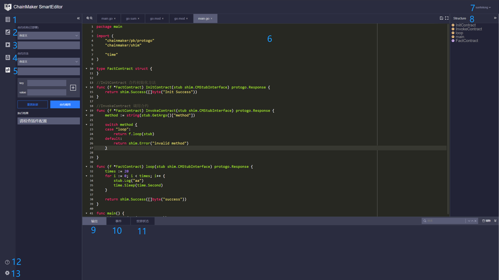
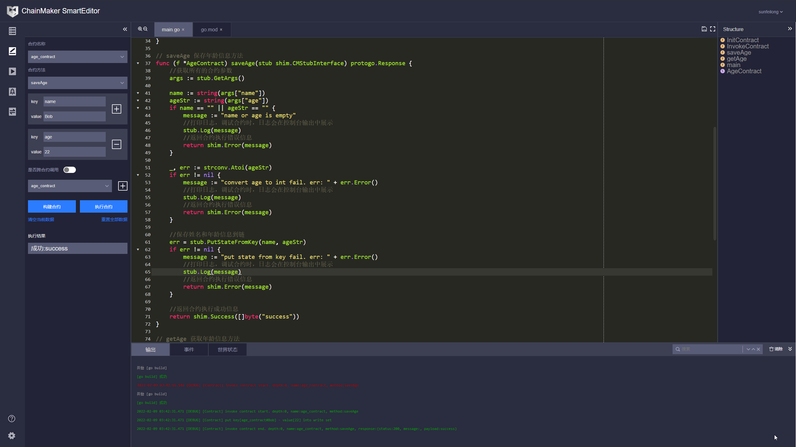
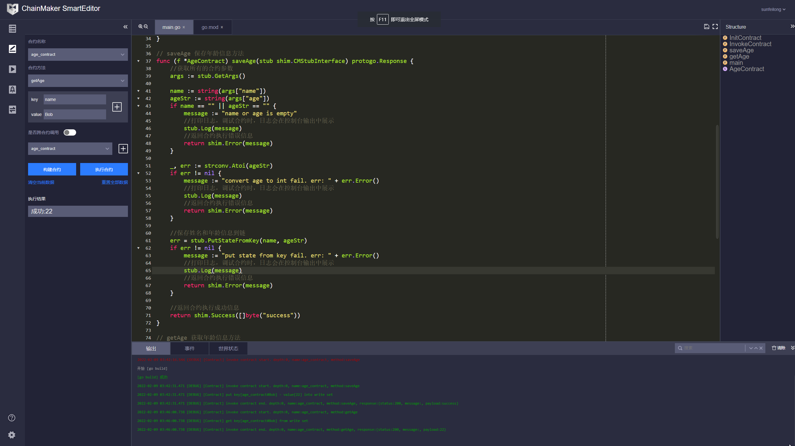

# 通过SmartIDE编写Go智能合约
作者：长安链团队  孙飞龙

## SmartIDE产品介绍

### SmartIDE背景介绍
目前市面上主流的后端开发语言还是以Java、Go等语种为主，而区块链行业智能合约的开发语言的以Solidity居多，对于传统语种开发者想转型做合约开发而言存在一定的语言门槛。

为了降低使用门槛，使区块链出圈，团队致力打造Go语言合约相关生态，考虑到目前市面上尚无专门为Go语言服务的合约IDE产品，故我们自行研发长安链合约IDE， Chainmaker SmartEditor。

- 该产品目前免费对外提供服务，前往使用：[https://ide.chainmaker.org.cn/](https://ide.chainmaker.org.cn/)
- 可使用长安链开源gitlab账户直接登录。

### SmartIDE界面概述

合约IDE是一个在线合约编辑器，使用合约IDE可以方便、快速的写合约。我们看一下合约IDE长什么样：



**IDE功能介绍**：

1. 文件目录：在 `workspace` 下创建的每一个目录都是一个单独的合约项目。可以创建多个合约项目。
2. 合约调试：模拟执行合约。
   1. 合约执行过程中打印的日志会在 `控制台->输出` 中展示。
   2. 合约执行过程中发送的事件会在`控制台->事件` 中展示。
   3. 合约执行的世界状态会在 `控制台->世界状态` 中展示。
   4. 合约执行结果会在执行结果下面显示。
3. 合约编译：编译合约，生成要部署的合约文件。
4. 合约部署：调用插件，通过插件部署合约到链上。
5. 合约调用：调用插件，通过插件调用链上的合约。
6. 代码编辑区：编写合约代码的地方。
7. 用户信息：用户名退出登录。
8. 代码大纲：显示代码整体结构，点击可快速跳转。
9. 控制台-输出：输出合约编译，合约调用过程的日志信息。
10. 控制台-事件：展示模拟执行过程产生的事件。
11. 控制台-世界状态：展示模拟执行时链的世界状态。
12. 帮助文档：点击跳转到帮助页面。
13. 设置：个性化设置。

## SDK 简介

```go
"chainmaker/logger"
"chainmaker/shim"
"chainmaker/pb/protogo"
```

上面是合约SDK提供的包。我们写合约时不需要完全了解包里面的内容，只需要知道里面一小部内容即可。

`chainmaker/logger`：是SDK的日志包，在合约内部我们可以通过其它方式打印日志，因此我们写合约的时候不会用到。

`chainmaker/shim`：是合约SDK的核心包，虽然是核心包，但是我们写合约的时候也只需要知道接口类型 `CMContract` 和 `CMStubInterface`。 

* `CMContract` 定义合约需要实现的方法，因此合约需要实现该接口定义的方法。
* `CMStubInterface` 接口定义了和链交互的方法，我们写合约时通过调用这些方法和链进行交互。

`chainmaker/pb/protogo`：我们只需要知道里面的一个结构体类型 `Response`  ，`Response` 是合约初始化方法和合约调用返回值的类型。

了解上面这些内容我们就可以开始在IDE中写合约了。下面我们看一下怎么写一个合约。

## 使用 `SDK`写一个简单合约

下面我们将写一个合约，合约的功能是保存和查询用户的年龄信息，合约的名字叫 `age_contract`。合约有两个方法：

第一个方法 `saveAge`：保存年龄信息。接收两个参数：姓名 `name` 和年龄 `age`，把姓名和年龄保存到链上，成功返回成功信息，失败返回错误信息。

第二个方法 `getAge`：查询年龄信息。接收一个参数 `name` ，如果链上存在用户的年龄信息则返回，如果不存在则返回 `-1`。

**编写合约的步骤如下：**

1. 创建合约。在 `文件目录的 workspace`上点击鼠标右键，选择创建合约工程，输入合约名字 `age_contract`，然后点击创建，此时在文件目录会有一个合约工程 `age_contract`。

2. 第二步创建合约文件。在 `age_contract` 上点击鼠标右键，选择创建文件，输入 `main.go`。然后点击创建，此时在 `arg_contract` 目录会有一个 `main.go` 文件。

3. 开始编写合约。打开 `main.go`, 复制下面代码到代码编辑区。保存代码 (`CTRL+s`)，保存时合约IDE会自动生成 `go.mod` 和 `go.sum` 文件。

    ```go
    package main

    import (
        "chainmaker/pb/protogo"
        "chainmaker/shim"
    )

    // AgeContract save and get age
    type AgeContract struct {
    }

    // InitContract 合约初始化方法，会在合约部署到链上时执行
    func (ac *AgeContract) InitContract(stub shim.CMStubInterface) protogo.Response {
        return shim.Success([]byte("Init Success"))
    }

    // InvokeContract 调用合约，在链上执行合约时，实际调用的是这个方法，此时调用合约会直接返回错误信息 `no contarct method`
    func (ac *AgeContract) InvokeContract(stub shim.CMStubInterface) protogo.Response {
        return shim.Error("no contarct method")
    }
    
    //合约入口
    func main() {
        //运行合约
        err := shim.Start(new(AgeContract))
        if err != nil {
            panic(err)
        }
    }
    ```
    
    这段代码是空合约模板，没有实现任何方法，以后写合约的时候都可以先复制这段代码初始化合约文件。后面我们要做的是增加两个合约方法 `saveAge` 和 `getAge`。
    
4. 增加 `saveAge` 和 `getAge` 方法。复制下面代码到 `main.go`。

    ```go
    package main
    
    import (
        "strconv"
    
        "chainmaker/pb/protogo"
        "chainmaker/shim"
    )
    
    // AgeContract save and get age
    type AgeContract struct {
    }
    
    // InitContract 合约初始化方法，会在合约部署到链上时执行
    func (ac *AgeContract) InitContract(stub shim.CMStubInterface) protogo.Response {
        return shim.Success([]byte("Init Success"))
    }
    
    // InvokeContract 调用合约，在链上执行合约时，实际调用的是这个方法
    func (ac *AgeContract) InvokeContract(stub shim.CMStubInterface) protogo.Response {
        return shim.Error("no contarct method")
    }
    
    // saveAge 保存用户年龄信息
    func (ac *AgeContract) saveAge(stub shim.CMStubInterface) protogo.Response {
        //获取所有的合约参数
        args := stub.GetArgs()
    
        name := string(args["name"])
        ageStr := string(args["age"])
        if name == "" || ageStr == "" {
            message := "name or age is empty"
            //打印日志，调试合约时，日志会在控制台输出中展示
            stub.Log(message)
            //返回合约执行错误信息
            return shim.Error(message)
        }
    
        _, err := strconv.Atoi(ageStr)
        if err != nil {
            message := "convert age to int fail. err: " + err.Error()
            //打印日志，调试合约时，日志会在控制台输出中展示
            stub.Log(message)
            //返回合约执行错误信息
            return shim.Error(message)
        }
    
        //保存用户年龄信息到链
        err = stub.PutStateFromKey(name, ageStr)
        if err != nil {
            message := "put state from key fail. err: " + err.Error()
            //打印日志，调试合约时，日志会在控制台输出中展示
            stub.Log(message)
            //返回合约执行错误信息
            return shim.Error(message)
        }
    
        //返回合约执行成功信息
        return shim.Success([]byte("success"))
    }
    
    // getAge 获取用户年龄信息
    func (ac *AgeContract) getAge(stub shim.CMStubInterface) protogo.Response {
        //获取所有的合约参数
        args := stub.GetArgs()
    
        name := string(args["name"])
        if name == "" {
            message := "name is empty"
            //打印日志，调试合约时，日志会在控制台输出中展示
            stub.Log(message)
            //返回合约执行错误信息
            return shim.Error("-1")
        }
    
        ageStr, err := stub.GetStateFromKey(name)
        if err != nil {
            message := "get state from key fail. err: " + err.Error()
            //打印日志，调试合约时，日志会在控制台输出中展示
            stub.Log(message)
            //返回合约执行错误信息
            return shim.Error("-1")
        }
    
        if ageStr == "" {
            message := "age not found"
            //打印日志，调试合约时，日志会在控制台输出中展示
            stub.Log(message)
            //返回合约执行错误信息
            return shim.Error("-1")
        }
    
        //返回用户年龄
        return shim.Success([]byte(ageStr))
    }
    
    func main() {
        //运行合约
        err := shim.Start(new(AgeContract))
        if err != nil {
            panic(err)
        }
    }
    ```

    这段代码较第三步增加了两个方法：

    ```go
    func (ac *AgeContract) saveAge(stub shim.CMStubInterface) protogo.Response {}
    func (ac *AgeContract) getAge(stub shim.CMStubInterface) protogo.Response {}
    ```

    这两个方法分别是存储和查询用户年龄。

    此时`saveAge` 和  `getAge` 方法是孤立存在的，不能通过合约调用到对应的方法，下面我们将在合约调用方法中关联合约和方法，这样调用合约方法时就能找到对应的方法。

5. 关联合约方法。复制完整的合约代码到 `main.go`。

    修改 `AgeContract .InvokeContract()` 方法，增加关联合约方法代码。修改后的内容如下：
    
    ```go
     // InvokeContract 调用合约，在链上执行合约时，实际调用的是这个方法
    func (ac *AgeContract) InvokeContract(stub shim.CMStubInterface) protogo.Response {
        //获取要调用的合约方法
        method := string(stub.GetArgs()["method"])
    
        //case "saveAge" 关联方法名 "saveAge" 到 ac.saveAge()
        //case "getAge"  关联方法名 "getAge"  到 ac.getAge()
        switch method {
        case "saveAge":
            return ac.saveAge(stub)
        case "getAge":
            return ac.getAge(stub)
        default:
            return shim.Error("no contarct method")
        }
    }
    ```
   
    完整的合约代码如下：

    ```go
    package main
    
    import (
        "strconv"
    
        "chainmaker/pb/protogo"
        "chainmaker/shim"
    )
    
    // AgeContract save and get age
    type AgeContract struct {
    }
    
    // InitContract 合约初始化方法，会在合约部署到链上时执行
    func (ac *AgeContract) InitContract(stub shim.CMStubInterface) protogo.Response {
        return shim.Success([]byte("Init Success"))
    }
    
    // InvokeContract 调用合约，在链上执行合约时，实际调用的是这个方法
    func (ac *AgeContract) InvokeContract(stub shim.CMStubInterface) protogo.Response {
        //获取要调用的合约方法
        method := string(stub.GetArgs()["method"])
    
        //case "saveAge" 关联方法名 "saveAge" 到 ac.saveAge()
        //case "getAge"  关联方法名 "getAge"  到 ac.getAge()
        switch method {
        case "saveAge":
            return ac.saveAge(stub)
        case "getAge":
            return ac.getAge(stub)
        default:
            return shim.Error("no contarct method")
        }
    }
    
    // saveAge 保存用户年龄信息
    func (ac *AgeContract) saveAge(stub shim.CMStubInterface) protogo.Response {
        //获取所有的合约参数
        args := stub.GetArgs()
    
        name := string(args["name"])
        ageStr := string(args["age"])
        if name == "" || ageStr == "" {
            message := "name or age is empty"
            //打印日志，调试合约时，日志会在控制台输出中展示
            stub.Log(message)
            //返回合约执行错误信息
            return shim.Error(message)
        }
    
        _, err := strconv.Atoi(ageStr)
        if err != nil {
            message := "convert age to int fail. err: " + err.Error()
            //打印日志，调试合约时，日志会在控制台输出中展示
            stub.Log(message)
            //返回合约执行错误信息
            return shim.Error(message)
        }
    
        //保存用户年龄信息到链上
        err = stub.PutStateFromKey(name, ageStr)
        if err != nil {
            message := "put state from key fail. err: " + err.Error()
            //打印日志，调试合约时，日志会在控制台输出中展示
            stub.Log(message)
            //返回合约执行错误信息
            return shim.Error(message)
        }
    
        //返回合约执行成功信息
        return shim.Success([]byte("success"))
    }
    
    // getAge 获取用户年龄信息
    func (ac *AgeContract) getAge(stub shim.CMStubInterface) protogo.Response {
        //获取所有的合约参数
        args := stub.GetArgs()
    
        name := string(args["name"])
        if name == "" {
            message := "name is empty"
            //打印日志，调试合约时，日志会在控制台输出中展示
            stub.Log(message)
            //返回合约执行错误信息
            return shim.Error("-1")
        }
    
        ageStr, err := stub.GetStateFromKey(name)
        if err != nil {
            message := "get state from key fail. err: " + err.Error()
            //打印日志，调试合约时，日志会在控制台输出中展示
            stub.Log(message)
            //返回合约执行错误信息
            return shim.Error("-1")
        }
    
        if ageStr == "" {
            message := "age not found"
            //打印日志，调试合约时，日志会在控制台输出中展示
            stub.Log(message)
            //返回合约执行错误信息
            return shim.Error("-1")
        }
    
        //返回用户年龄
        return shim.Success([]byte(ageStr))
    }
    
    func main() {
        //运行合约
        err := shim.Start(new(AgeContract))
        if err != nil {
            panic(err)
        }
    }
    ```

6. 测试合约执行效果。至此我们的合约已经编写完成，下面我们可以通过合约调试功能测试一下合约执行效果。先双击 `main.go`，然后点击合约调试图标。如图所示，选中 `saveAge` 方法，增加 `name` 和 `age` 参数。然后点击构建合约，等构建完成之后点击执行合约，保存用户年龄信息到链上。

    左侧 **构建和执行合约** 按钮下面会显示合约执行结果。

    **控制台->输出** 会打印合约执行日志 `stub.Log()` 的内容。
    
    **控制台->世界状态** 会显示合约的世界状态。`{key:"Bob","value":"22"}`
    

    


7. 调用 `getAge` 方法，查询存储的用户年龄信息。如下图：选中 `getAge` 方法，增加 `name` 参数，然后点击构建并执行。

    左侧 **构建和执行合约** 按钮下面会显示合约执行结果。

    **控制台->输出** 会打印合约执行日志 `stub.Log()` 的内容。

    **控制台->世界状态** 会显示合约的世界状态。`{key:"Bob","value":"22"}`

Smartide-invokeGetAge
   
 

## SDK 详细介绍

上面我们一步一步创建了一个简单的合约，用到了SDK提供的一小部分方法。

```go
//保存用户年龄信息到链上
err = stub.PutStateFromKey(name, ageStr)
//从链上查询用户年龄信息
ageStr, err := stub.GetStateFromKey(name)
```

下面详细介绍一下SDK提供的方法。

### `shim.CMStubInterface` 接口

`shim.CMStubInterface` 定义了和链交互的方法，我们通过在合约中调用该接口的方法和链交互。方法列表如下：

```go
# 获取合约执行的参数
GetArgs() map[string][]byte

# 从链上查询信息
# 查询信息 指定 key field
GetState(key, field string) (string, error)
GetStateByte(key, field string) ([]byte, error)
# 查询信息 指定 key
GetStateFromKey(key string) (string, error)
GetStateFromKeyByte(key string) ([]byte, error)

# 存储数据到链上
# 存储信息 指定key field
PutState(key, field string, value string) error
PutStateByte(key, field string, value []byte) error
# 存储信息 指定 key
PutStateFromKey(key string, value string) error
PutStateFromKeyByte(key string, value []byte) error

# 从链上删除数据
# 删除信息 指定key field
DelState(key, field string) error
# 删除信息 指定key
DelStateFromKey(key string) error

# 获取合约创建者的组织ID
GetCreatorOrgId() (string, error)
# 获取合约创建者的角色
GetCreatorRole() (string, error)
# 获取合约创建者的公钥
GetCreatorPk() (string, error)
# 获取交易发起者的组织ID
GetSenderOrgId() (string, error)
# 获取交易交易发起者的角色
GetSenderRole() (string, error)
# 获取交易发起者的公钥
GetSenderPk() (string, error)
# 获取当前块高度
GetBlockHeight() (int, error)
# 获取交易ID
GetTxId() (string, error)
# 获取交易时间戳
GetTxTimeStamp() (string, error)

# 发布合约事件
EmitEvent(topic string, data []string)

# 记录合约日志
Log(message string)

# 跨合约调用
CallContract(contractName, contractVersion string, args map[string][]byte) protogo.Response

# 范围查询迭代器 [startKey, limitKey)
NewIterator(startKey string, limitKey string) (ResultSetKV, error)
# 范围查询迭代器 [key+startField, key+limitField)
NewIteratorWithField(key string, startField string, limitField string) (ResultSetKV, error)
# 前缀范围查询迭代器 有 `key+field` 前缀的数据
NewIteratorPrefixWithKeyField(key string, field string) (ResultSetKV, error)
# 前缀范围查询迭代器 有 `key` 前缀的数据
NewIteratorPrefixWithKey(key string) (ResultSetKV, error)
          
# 历史数据查询迭代器 key+field 数据的历史版本
NewHistoryKvIterForKey(key, field string) (KeyHistoryKvIter, error)

# 查询交易发起方地址
GetSenderAddr() (string, error)
          
// 结果集
type ResultSet interface {
	// NextRow get next row,
	// sql: column name is EasyCodec key, value is EasyCodec string val. as: val := ec.getString("columnName")
	// kv iterator: key/value is EasyCodec key for "key"/"value", value type is []byte. as: k, _ := ec.GetString("key") v, _ := ec.GetBytes("value")
	NextRow() (*serialize.EasyCodec, error)
	// HasNext return does the next line exist
	HasNext() bool
	// Close .
	Close() (bool, error)
}

type ResultSetKV interface {
	ResultSet
	// Next return key,field,value,code
	Next() (string, string, []byte, error)
}

type KeyHistoryKvIter interface {
	ResultSet
	// Next return txId, blockHeight, timestamp, value, isDelete, error
	Next() (*KeyModification, error)
}
```

写合约的时候我们通过编写代码完成合约逻辑，SDK提供了合约和链交互的方法，帮助我们完成和链交互。

###  `shim.CMStubInterface` 详细介绍

1. 跨合约调用，即在A合约中调用B合约的方法。跨合约调用需要用到 `CallContract` 方法。代码如下：

    ```go
    //crossCall 跨合约调用
    func (ac *AgeContract) crossCall(stub shim.CMStubInterface) protogo.Response {
        
    	//要调用的合约的基本信息
    	contractName := "age_contract"
    	contractVersion := "1.0.0"
    	calledMethod := "getAge"
    
    	//跨合约调用的参数
    	crossContractArgs := make(map[string][]byte)
    	crossContractArgs["method"] = []byte(calledMethod)
    	crossContractArgs["name"] = []byte("Bob")
    
        //开合约调用响应信息
    	response := stub.CallContract(contractName, contractVersion, crossContractArgs)
    	stub.EmitEvent("cross contract", []string{"success"})
    	return response
    }
    ```

2. 迭代器使用，查询用户年龄的历史版本。

    ```go
    //historyKvIterator 历史迭代器
	func (ac *AgeContract) historyKvIterator(stub shim.CMStubInterface) protogo.Response {
		key := "Bob"
		//创建历史迭代器
		result, err := stub.NewHistoryKvIterForKey(key, "")
		if err != nil {
			msg := "failed to call get_state"
			stub.Log(msg + " " + err.Error())
			return shim.Error(msg)
	     }
	
		//判断迭代器是否有数据，如果有迭代输出数据
		for result.HasNext() {
			v, err := result.Next()
			if err != nil {
				msg := "failed to call iterator"
				stub.Log(msg + " " + err.Error())
				return shim.Error(msg)
			}
			stub.Log(fmt.Sprintf("NewHistoryKvIterForKey %v\n", v))
	    }
	
    	return shim.Success([]byte("success"))
    }
    ```

3. 完整合约。包含 保存用户年龄信息`saveAge`、 查询用户年龄信息`getAge` 开合约调用`crossCall` 和 历史迭代器`historyKvIterator`。

    ```go
    package main

    import (
        "fmt"
        "strconv"

        "chainmaker/pb/protogo"
        "chainmaker/shim"
    )

    // AgeContract save and get age
    type AgeContract struct {
    }

    // InitContract 合约初始化方法，会在合约部署到链上时执行
    func (ac *AgeContract) InitContract(stub shim.CMStubInterface) protogo.Response {
        return shim.Success([]byte("Init Success"))
    }

    // InvokeContract 调用合约，在链上执行合约时，实际调用的是这个方法
    func (ac *AgeContract) InvokeContract(stub shim.CMStubInterface) protogo.Response {
        //获取要调用的合约方法
        method := string(stub.GetArgs()["method"])

        //case "***" 关联方法名 "***" 到 ac.***
        switch method {
        case "saveAge":
            return ac.saveAge(stub)
        case "getAge":
            return ac.getAge(stub)
        case "crossCall":
            return ac.crossCall(stub)
        case "historyKvIterator":
            return ac.historyKvIterator(stub)
        default:
            return shim.Error("no contarct method")
        }
    }

    // saveAge 保存用户年龄信息
    func (ac *AgeContract) saveAge(stub shim.CMStubInterface) protogo.Response {
        //获取所有的合约参数
        args := stub.GetArgs()

        name := string(args["name"])
        ageStr := string(args["age"])
        if name == "" || ageStr == "" {
            message := "name or age is empty"
            //打印日志，调试合约时，日志会在控制台输出中展示
            stub.Log(message)
            //返回合约执行错误信息
            return shim.Error(message)
        }

        _, err := strconv.Atoi(ageStr)
        if err != nil {
            message := "convert age to int fail. err: " + err.Error()
            //打印日志，调试合约时，日志会在控制台输出中展示
            stub.Log(message)
            //返回合约执行错误信息
            return shim.Error(message)
        }

        //保存用户年龄信息到链上
        err = stub.PutStateFromKey(name, ageStr)
        if err != nil {
            message := "put state from key fail. err: " + err.Error()
            //打印日志，调试合约时，日志会在控制台输出中展示
            stub.Log(message)
            //返回合约执行错误信息
            return shim.Error(message)
        }

        //返回合约执行成功信息
        return shim.Success([]byte("success"))
    }

    // getAge 获取用户年龄信息
    func (ac *AgeContract) getAge(stub shim.CMStubInterface) protogo.Response {
        //获取所有的合约参数
        args := stub.GetArgs()

        name := string(args["name"])
        if name == "" {
            message := "name is empty"
            //打印日志，调试合约时，日志会在控制台输出中展示
            stub.Log(message)
            //返回合约执行错误信息
            return shim.Error("-1")
        }

        ageStr, err := stub.GetStateFromKey(name)
        if err != nil {
            message := "get state from key fail. err: " + err.Error()
            //打印日志，调试合约时，日志会在控制台输出中展示
            stub.Log(message)
            //返回合约执行错误信息
            return shim.Error("-1")
        }

        if ageStr == "" {
            message := "age not found"
            //打印日志，调试合约时，日志会在控制台输出中展示
            stub.Log(message)
            //返回合约执行错误信息
            return shim.Error("-1")
        }

        //返回用户年龄
        return shim.Success([]byte(ageStr))
    }

    //crossCall 跨合约调用
    func (ac *AgeContract) crossCall(stub shim.CMStubInterface) protogo.Response {

        //要调用的合约的基本信息
        contractName := "age_contract"
        contractVersion := "1.0.0"
        calledMethod := "getAge"

        //跨合约调用的参数
        crossContractArgs := make(map[string][]byte)
        crossContractArgs["method"] = []byte(calledMethod)
        crossContractArgs["name"] = []byte("Bob")

        //开合约调用响应信息
        response := stub.CallContract(contractName, contractVersion, crossContractArgs)
        stub.EmitEvent("cross contract", []string{"success"})
        return response
    }

    //historyKvIterator 历史迭代器
    func (ac *AgeContract) historyKvIterator(stub shim.CMStubInterface) protogo.Response {
        key := "Bob"
        //创建历史迭代器
        result, err := stub.NewHistoryKvIterForKey(key, "")
        if err != nil {
            msg := "failed to call get_state"
            stub.Log(msg + " " + err.Error())
            return shim.Error(msg)
        }

        //判断迭代器是否有数据，如果有迭代输出数据
        for result.HasNext() {
            v, err := result.Next()
            if err != nil {
                msg := "failed to call iterator"
                stub.Log(msg + " " + err.Error())
                return shim.Error(msg)
            }
            stub.Log(fmt.Sprintf("NewHistoryKvIterForKey %v\n", v))
        }

        return shim.Success([]byte("success"))
    }

    func main() {
        //运行合约
        err := shim.Start(new(AgeContract))
        if err != nil {
            panic(err)
        }
    }
    ```

## 编写合约注意事项

1. 合约工程目录下必须有一个 `main.go`，且 `main.go` 的包名需要是 `main`，合约的入口需要在 `main.go` 中，且 `InvokeContract()` 方法代码需要在 `main.go` 中。即 ：

    ```go
    package main

    import (
        "chainmaker/pb/protogo"
        "chainmaker/shim"
    )
    
    ... ...
    ... ...
    
    // 调用合约方法
    func (f *AgeContract) InvokeContract(stub shim.CMStubInterface) protogo.Response {
        //获取要调用的合约方法
        method := string(stub.GetArgs()["method"])
    
        //case "saveAge" 关联方法名 "saveAge" 到 f.saveAge()
        //case "getAge"  关联方法名 "getAge"  到 f.getAge()
        switch method {
        case "saveAge":
            return f.saveAge(stub)
        case "getAge":
            return f.getAge(stub)
        default:
            return shim.Error("no contarct method")
        }
    }
    
    // 合约入口
    func main() {
        //运行合约
        err := shim.Start(new(AgeContract))
        if err != nil {
        panic(err)
        }
    }
    ```

2.  `InvokeContract` 里面关联方法逻辑需要是如下模式（合约调试会根据下面的模式解析方法名）。注意不要在 case 后面使用定义的常量。

    ```go
     switch method {
        case "字符串":
            ... ...
        case "字符串":
            ... ...
        default:
            return shim.Error("no contarct method")
        }
    ```

3. 不能使用全局变量。在编写合约时，不要使用全局变量来存储数据，数据的存储可以直接存到链上，用 `getState` 和 `putState` 等方法存储。

4. 不支持在合约工程内创建内嵌的 go module。


