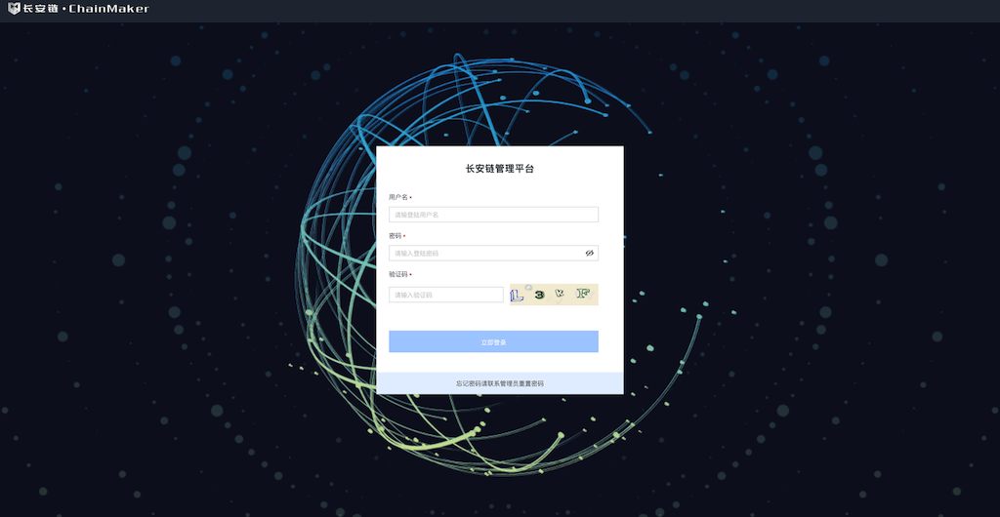

## 启动pk模式的链
作者：长安链团队 宋丹阳

### 通过管理台启动pk模式的链

#### 登录


- 私有化部署本平台时会生成的对应的admin账号，默认密码为a123456

#### 新增节点账户


- 填写账户备注名
- 选择节点账户
- 支持申请国密和非国密两种证书。

#### 新增用户账户


- 填写账户备注名
- 选择用户账户
- 支持申请国密和非国密两种证书。

#### 新建区块链


- 选择公钥模式
- 链配置文件参数设定
  - 此处用于新增链配置文件，目前支持自定义链的id、名称、区块最大容量，出块间隔、交易过期时长，以及共识配置。
  - 目前支持配置TBFT、DPOS等共识。
  - 申请链配置文件前，请先确保，所需的节点和用户账户已经申请/导入本管理平台。
  - 支持根据需求选择你要部署的链所支持的虚拟机类型。
  - 支持单机部署和多机部署，请正确填写所要之后要部署区块链节点的机器所在的ip，并确保端口不冲突。
  - 如果开启报错日志采集服务，则在您部署到链运行过程中如果发生异常，管理台会收集报错日志，并汇总展示，方便定位问题。如果您开启了参与长安链改进计划，则采集到的报错日志，将自动上传给长安链官方团队，方便团队持续改进产品。

#### 下载部署链


- 部署区块链
  - 下载链配置以zip包为准，zip包包含对应的链配置文件和部署脚本
  - 将下载的包移动到需要部署的机器上去（可以使用scp进行移动）
  - 执行`unzip`解压成`release`包，进入`release`包执行`start.sh`进行启动

#### 快速订阅链


- 链部署成功之后在管理台进行快速订阅
- 公钥需要选择公钥模式

#### 部署/调用合约验证链是否正常
订阅成功后，可进行部署/调用示例合约，以检查链功能是否正常。部署合约的使用教程可详见：[部署示例合约](./部署示例合约.md)。

### 通过命令行启动pk模式的链

#### 证书生成
- 进入chainmaker-go/scripts目录，执行prepare_pk.sh脚本生成单链4节点集群配置，存于路径chainmaker-go/build中

- prepare_pk.sh脚本支持生成4/7/10/13/16节点公私钥和配置
```
# 进入脚本目录
$ cd ../scripts

# 查看脚本帮助
$ ./prepare_pk.sh -h
Usage:
  prepare_pk.sh node_cnt(4/7/10/13/16) chain_cnt(1-4) p2p_port(default:11301) rpc_port(default:12301)
    eg1: prepare_pk.sh 4 1
    eg2: prepare_pk.sh 4 1 11301 12301

# 生成单链4节点集群的密钥和配置
$ ./prepare_pk.sh 4 1
begin check params...
begin generate keys, cnt: 4
input consensus type (1-TBFT(default),5-DPOS):
input log level (DEBUG|INFO(default)|WARN|ERROR):
input hash type (SHA256(default)|SM3):
enable docker vm (YES|NO(default))
config node total 4
begin generate node1 config...
begin generate node2 config...
begin generate node3 config...
begin generate node4 config...

# 查看生成好的节点密钥和配置
$ tree -L 3 ../build/
../build/
├── config
│   ├── node1
│   │   ├── admin
│   │   ├── chainconfig
│   │   ├── chainmaker.yml
│   │   ├── log.yml
│   │   ├── node1.key
│   │   ├── node1.nodeid
│   │   ├── node1.pem
│   │   └── user
│   ├── node2
│   │   ├── admin
│   │   ├── chainconfig
│   │   ├── chainmaker.yml
│   │   ├── log.yml
│   │   ├── node2.key
│   │   ├── node2.nodeid
│   │   ├── node2.pem
│   │   └── user
│   ├── node3
│   │   ├── admin
│   │   ├── chainconfig
│   │   ├── chainmaker.yml
│   │   ├── log.yml
│   │   ├── node3.key
│   │   ├── node3.nodeid
│   │   ├── node3.pem
│   │   └── user
│   └── node4
│       ├── admin
│       ├── chainconfig
│       ├── chainmaker.yml
│       ├── log.yml
│       ├── node4.key
│       ├── node4.nodeid
│       ├── node4.pem
│       └── user
├── crypto-config
│   ├── node1
│   │   ├── admin
│   │   ├── node1.key
│   │   ├── node1.nodeid
│   │   ├── node1.pem
│   │   └── user
│   ├── node2
│   │   ├── admin
│   │   ├── node2.key
│   │   ├── node2.nodeid
│   │   ├── node2.pem
│   │   └── user
│   ├── node3
│   │   ├── admin
│   │   ├── node3.key
│   │   ├── node3.nodeid
│   │   ├── node3.pem
│   │   └── user
│   └── node4
│       ├── admin
│       ├── node4.key
│       ├── node4.nodeid
│       ├── node4.pem
│       └── user
└── crypto_config.yml   
```

#### 编译和安装包制作
- 生成证书（prepare.sh脚本）后执行build_release.sh脚本，将编译chainmaker-go模块，并打包生成安装，存于路径chainmaker-go/build/release中
```
$ ./build_release.sh
$ tree ../build/release/
../build/release/
├── chainmaker-v2.0.0-wx-org1.chainmaker.org-20210406194833-x86_64.tar.gz
├── chainmaker-v2.0.0-wx-org2.chainmaker.org-20210406194833-x86_64.tar.gz
├── chainmaker-v2.0.0-wx-org3.chainmaker.org-20210406194833-x86_64.tar.gz
├── chainmaker-v2.0.0-wx-org4.chainmaker.org-20210406194833-x86_64.tar.gz
└── crypto-config-20210406194833.tar.gz
```
#### 启动和停止链
- 执行cluster_quick_start.sh脚本，会解压各个安装包，调用bin目录中的start.sh脚本，启动chainmaker节点
```
$ ./cluster_quick_start.sh normal
```
- 启动成功后，将*.tar.gz备份，以免下次启动再次解压缩时文件被覆盖

```
$ mkdir -p ../build/bak
$ mv ../build/release/*.tar.gz ../build/bak
```
若需要关闭集群，使用脚本：

```
$ ./cluster_quick_stop.sh
```

#### 查看节点是否存在
- 查看进程
```
$ ps -ef|grep chainmaker | grep -v grep
25261  2146  4 19:55 pts/20   00:00:01 ./chainmaker start -c ../config/wx-org1.chainmaker.org/chainmaker.yml
25286  2146  4 19:55 pts/20   00:00:01 ./chainmaker start -c ../config/wx-org2.chainmaker.org/chainmaker.yml
25309  2146  4 19:55 pts/20   00:00:01 ./chainmaker start -c ../config/wx-org3.chainmaker.org/chainmaker.yml
25335  2146  4 19:55 pts/20   00:00:01 ./chainmaker start -c ../config/wx-org4.chainmaker.org/chainmaker.yml
```
- 查看端口
```
$ netstat -lptn | grep 1230
tcp6       0      0 :::12301                :::*                    LISTEN      25261/./chainmaker  
tcp6       0      0 :::12302                :::*                    LISTEN      25286/./chainmaker  
tcp6       0      0 :::12303                :::*                    LISTEN      25309/./chainmaker  
tcp6       0      0 :::12304                :::*                    LISTEN      25335/./chainmaker 
```
- 查看日志
```
$ cat ../build/release/*/bin/panic.log
$ cat ../build/release/*/log/system.log
$ cat ../build/release/*/log/system.log |grep "ERROR\|put block\|all necessary"
//若看到all necessary peers connected则表示节点已经准备就绪。
```

#### 部署/调用合约验证链是否正常
启动成功后，可进行部署/调用示例合约，以检查链功能是否正常。部署合约的使用教程可详见：[部署示例合约](./部署示例合约.md)。