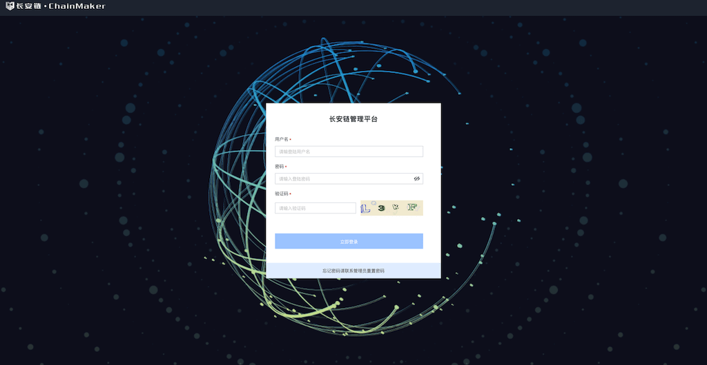
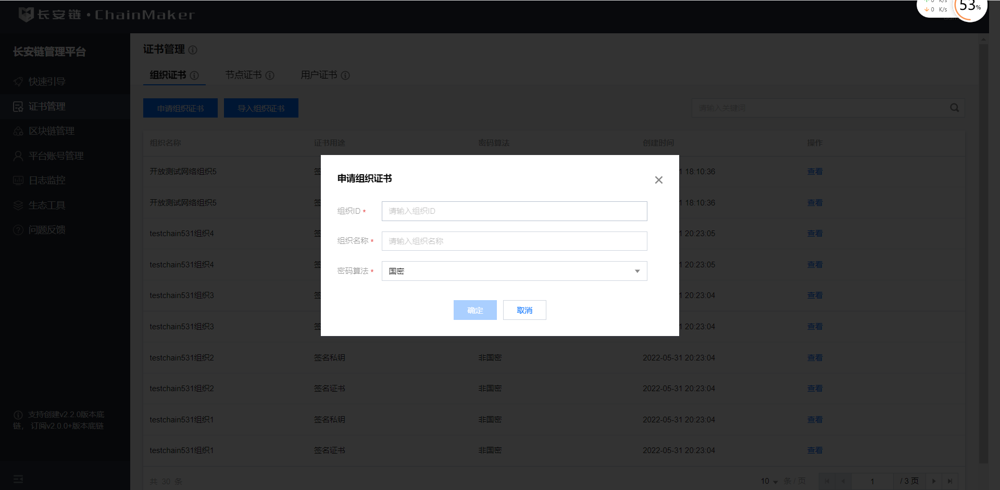
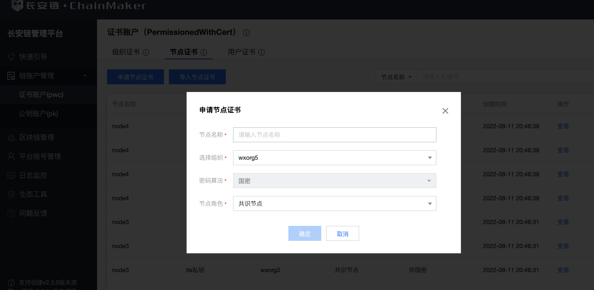
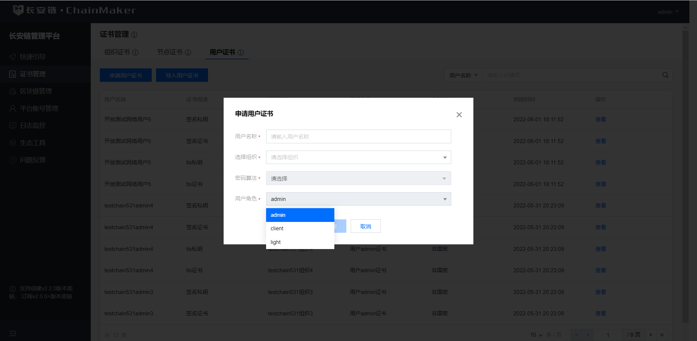
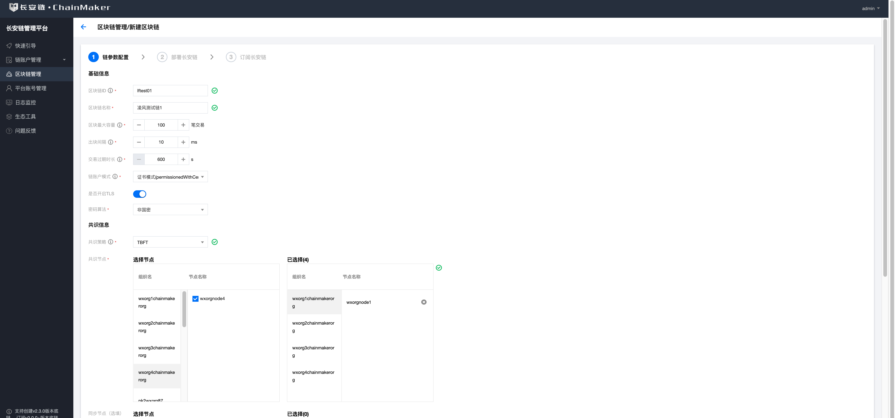
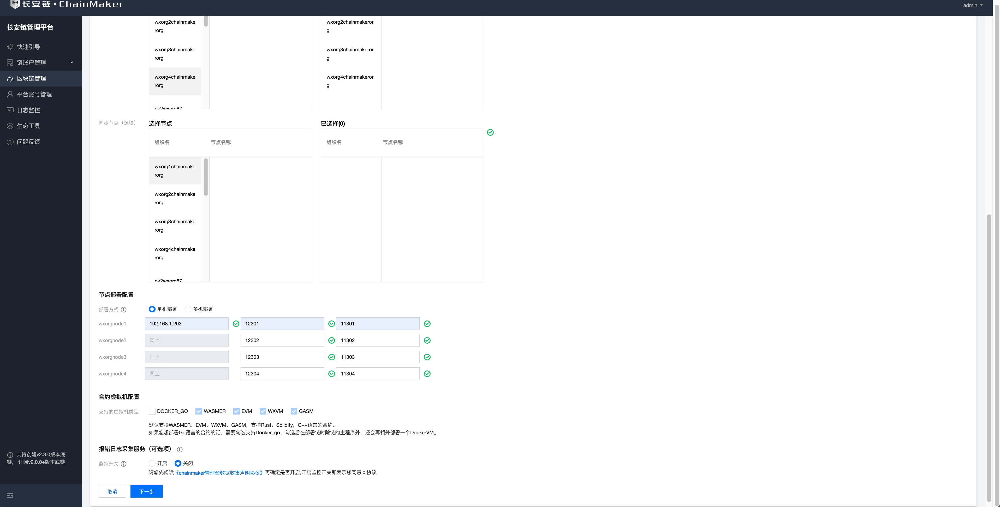
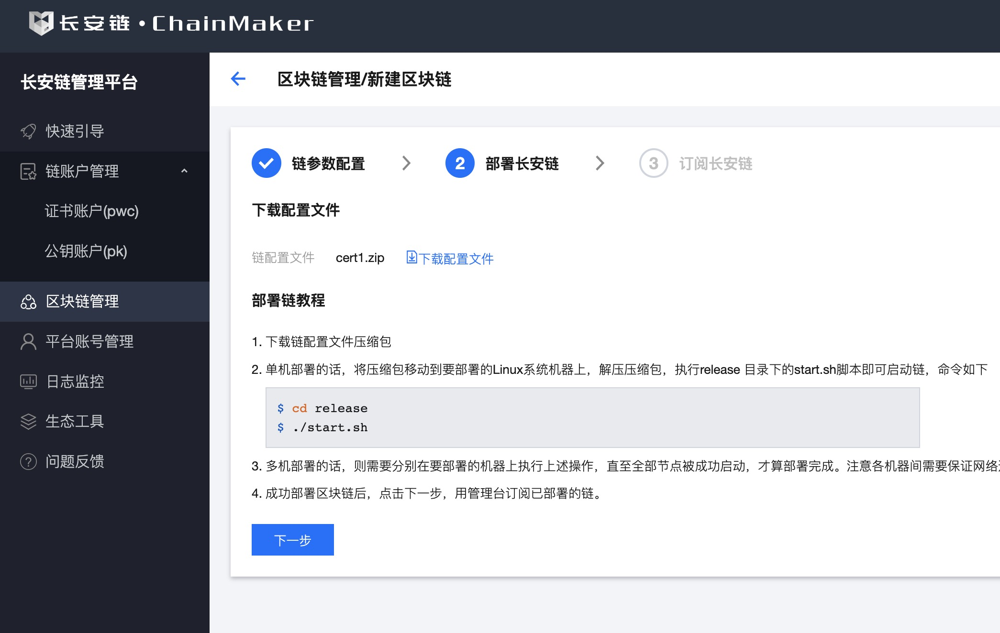
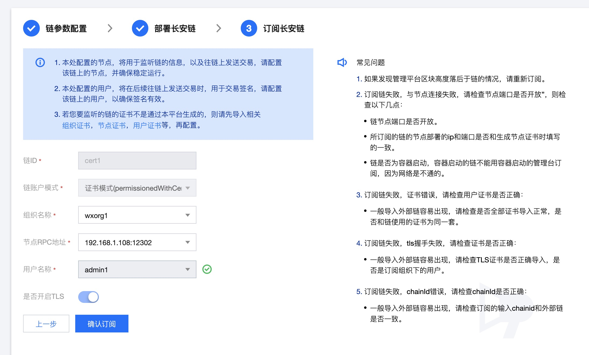
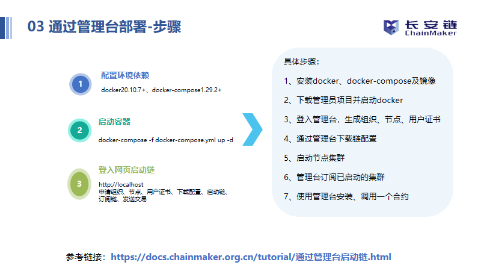

## 启动国密证书模式的链
作者：长安链团队 宋丹阳

### 通过管理台启动国密链

<a id='3.1.1'></a>

#### 登录


- 私有化部署本平台时会生成的对应的admin账号，默认密码为a123456

<a id='3.1.2'></a>

#### 新增组织证书


- 填写组织ID和组织名称
- 组织ID和组织名称不能重复
- 密码算法选择国密

#### 新增节点证书


- 目前节点证书角色分为共识节点和同步节点两种。
- 通过填写节点名称、组织信息，节点角色，申请节点证书。
- 密码算法选择国密

#### 新增用户证书


- 目前用户证书角色分为admin、client和light三种。
- 通过填写用户名称、组织信息，用户角色申请用户证书。
- 密码算法选择国密
- 合约部署需要对应的管理员证书，所以需要申请对应的管理员用户

#### 新建区块链




- 选择证书模式
- 链配置文件参数设定
  - 此处用于新增链配置文件，目前支持自定义链的id、名称、区块最大容量，出块间隔、交易过期时长，以及共识配置。
  - 注意密码算法处要选择国密算法。
  - 目前支持配置TBFT、RAFT、SOLO、MAXBFT共识。
  - 申请链配置文件前，请先确保，所需的组织和节点证书已经申请/导入本管理平台。
  - 支持根据需求选择你要部署的链所支持的虚拟机类型。
  - 支持单机部署和多机部署，请正确填写所要之后要部署区块链节点的机器所在的ip和端口，并确保在ip相同的情况下端口不冲突。
  - 如果开启报错日志采集服务，则在您部署到链运行过程中如果发生异常，管理台会收集报错日志，并汇总展示，方便定位问题。如果您开启了参与长安链改进计划，则采集到的报错日志，将自动上传给长安链官方团队，方便团队持续改进产品。

#### 下载部署链


- 部署区块链
  - 下载链配置以zip包为准，zip包包含对应的链配置文件和部署脚本
  - 将下载的包移动到需要部署的机器上去（可以使用scp进行移动）
  - 执行`unzip`解压成`release`包，进入`release`包执行`start.sh`进行启动

#### 快速订阅链


- 链部署成功之后在管理台进行快速订阅

#### 视频教程

<a href="https://www.bilibili.com/video/BV1Dr4y1W7MP/" target="_blank" title="点击跳转至播放页面" ></a>

视频地址: <a href="https://www.bilibili.com/video/BV1Dr4y1W7MP/"  target="_blank">  使用管理台部署长安链V2.0 </a>

### 通过命令行启动国密链

#### 进行国密配置

- 进入`chainmaker-go/config/config_tpl/chainconfig`目录,修改`bc_4_7.yml`配置文件里的算法`crypto.hash`为国密
```
# 国密
# Crypto settings
crypto:
  # Hash algorithm, can be SHA256, SHA3_256 and SM3
  hash: SM3
# 非国密
# Crypto settings
crypto:
  # Hash algorithm, can be SHA256, SHA3_256 and SM3
  hash: SHA256
```

- 进入`chainmaker-go/tools/chainmaker-cryptogen/config`目录,修改`crypto_config_template.yml`配置文件里的算法`crypto_config.pk_algo`和`crypto_config.ski_hash`为国密
```
# 国密
crypto_config:
  - domain: chainmaker.org
    host_name: wx-org
    count: 4                # 如果为1，直接使用host_name，否则添加递增编号
    pk_algo: sm2
    ski_hash: sm3
# 非国密
crypto_config:
  - domain: chainmaker.org
    host_name: wx-org
    count: 4                # 如果为1，直接使用host_name，否则添加递增编号
    pk_algo: ecc_p256
    ski_hash: sha256
```

<a id='3.2.1'></a>

#### 证书生成

- 进入chainmaker-go/scripts目录，执行prepare.sh脚本生成单链4节点集群配置，存于路径chainmaker-go/build中

```
# 进入脚本目录
$ cd ../scripts
# 查看脚本帮助
$ ./prepare.sh -h
Usage:  
  prepare.sh node_cnt(1/4/7/10/13/16) chain_cnt(1-4) p2p_port(default:11301) rpc_port(default:12301)
    eg1: prepare.sh 4 1
    eg2: prepare.sh 4 1 11301 12301

# 生成单链4节点集群的证书和配置
$ ./prepare.sh 4 1
begin check params...
begin generate certs, cnt: 4
input consensus type (0-SOLO,1-TBFT(default),3-HOTSTUFF,4-RAFT,5-DPOS):
input log level (DEBUG|INFO(default)|WARN|ERROR):
enable docker vm (YES|NO(default))
begin generate node1 config...
begin generate node2 config...
begin generate node3 config...
begin generate node4 config...

# 查看生成好的节点证书和配置
$ tree -L 3 ../build/
../build/
├── config
│   ├── node1
│   │   ├── certs
│   │   ├── chainconfig
│   │   ├── chainmaker.yml
│   │   └── log.yml
│   ├── node2
│   │   ├── certs
│   │   ├── chainconfig
│   │   ├── chainmaker.yml
│   │   └── log.yml
│   ├── node3
│   │   ├── certs
│   │   ├── chainconfig
│   │   ├── chainmaker.yml
│   │   └── log.yml
│   └── node4
│       ├── certs
│       ├── chainconfig
│       ├── chainmaker.yml
│       └── log.yml
├── crypto-config
│   ├── wx-org1.chainmaker.org
│   │   ├── ca
│   │   ├── node
│   │   └── user
│   ├── wx-org2.chainmaker.org
│   │   ├── ca
│   │   ├── node
│   │   └── user
│   ├── wx-org3.chainmaker.org
│   │   ├── ca
│   │   ├── node
│   │   └── user
│   └── wx-org4.chainmaker.org
│       ├── ca
│       ├── node
│       └── user
└── crypto_config.yml
```
<a id='3.2.2'></a>

#### 编译和安装包制作
- 生成证书（prepare.sh脚本）后执行build_release.sh脚本，将编译chainmaker-go模块，并打包生成安装，存于路径chainmaker-go/build/release中
```
$ ./build_release.sh
$ tree ../build/release/
../build/release/
├── chainmaker-v2.0.0-wx-org1.chainmaker.org-20210406194833-x86_64.tar.gz
├── chainmaker-v2.0.0-wx-org2.chainmaker.org-20210406194833-x86_64.tar.gz
├── chainmaker-v2.0.0-wx-org3.chainmaker.org-20210406194833-x86_64.tar.gz
├── chainmaker-v2.0.0-wx-org4.chainmaker.org-20210406194833-x86_64.tar.gz
└── crypto-config-20210406194833.tar.gz
```
#### 启动和停止链
- 执行cluster_quick_start.sh脚本，会解压各个安装包，调用bin目录中的start.sh脚本，启动chainmaker节点
```
$ ./cluster_quick_start.sh normal
```
- 启动成功后，将*.tar.gz备份，以免下次启动再次解压缩时文件被覆盖

```
$ mkdir -p ../build/bak
$ mv ../build/release/*.tar.gz ../build/bak
```
若需要关闭集群，使用脚本：

```
$ ./cluster_quick_stop.sh
```
#### 查看节点是否存在
- 查看进程
```
$ ps -ef|grep chainmaker | grep -v grep
25261  2146  4 19:55 pts/20   00:00:01 ./chainmaker start -c ../config/wx-org1.chainmaker.org/chainmaker.yml
25286  2146  4 19:55 pts/20   00:00:01 ./chainmaker start -c ../config/wx-org2.chainmaker.org/chainmaker.yml
25309  2146  4 19:55 pts/20   00:00:01 ./chainmaker start -c ../config/wx-org3.chainmaker.org/chainmaker.yml
25335  2146  4 19:55 pts/20   00:00:01 ./chainmaker start -c ../config/wx-org4.chainmaker.org/chainmaker.yml
```
- 查看端口
```
$ netstat -lptn | grep 1230
tcp6       0      0 :::12301                :::*                    LISTEN      25261/./chainmaker  
tcp6       0      0 :::12302                :::*                    LISTEN      25286/./chainmaker  
tcp6       0      0 :::12303                :::*                    LISTEN      25309/./chainmaker  
tcp6       0      0 :::12304                :::*                    LISTEN      25335/./chainmaker 
```
- 查看日志
```
$ cat ../build/release/*/bin/panic.log
$ cat ../build/release/*/log/system.log
$ cat ../build/release/*/log/system.log |grep "ERROR\|put block\|all necessary"
//若看到all necessary peers connected则表示节点已经准备就绪。
```

#### 部署/调用合约验证链是否正常
启动成功后，可进行部署/调用示例合约，以检查链功能是否正常。部署合约的使用教程可详见：[部署示例合约](./部署示例合约.md)。


#### 视频教程


> 注：此视频教程为v1.0.0版本，长安链开源最新版本为v2.x.x，视频中遇到与版本号相关的，请更改为最新的版本。若为master分支，则已是最新v2.x.x版本
>
> 如：合约镜像为：docker pull chainmakerofficial/chainmaker-go-contract:v2.x.x


时间脚本:

• 01-04分钟：长安链简介及大纲介绍；

• 04-09分钟：环境安装演示；

• 09-26分钟：单机部署；

• 26-36分钟：智能合约开发（穿插常见问题）；

• 36-54分钟：部署合约（穿插常见问题）；

• 54---结束：常见问题及单机&多机部署对照表。

<a href="https://mp.weixin.qq.com/s/zGV320UDlGVVw1tTJcOsQQ" target="_blank" title="点击跳转至播放页面" ></a>

<!--

<iframe 
    width="100%" 
    height="450" 
    src="http://mpvideo.qpic.cn/0bf2zyaecaaalianjimylbqfbtwdihhaaqia.f10002.mp4?dis_k=2e34203a3e5cc39388748cf49c2b68ef&dis_t=1620901511&spec_id=Mzg4NzU2NjYwMA%3D%3D1620901511&vid=wxv_1862610372268965888&format_id=10002" 
    scrolling="no" 
    border="0" 
    frameborder="no" 
    framespacing="0" 
    allowfullscreen="true">
</iframe>
-->