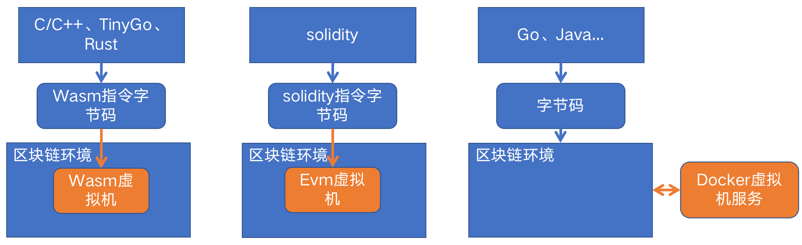
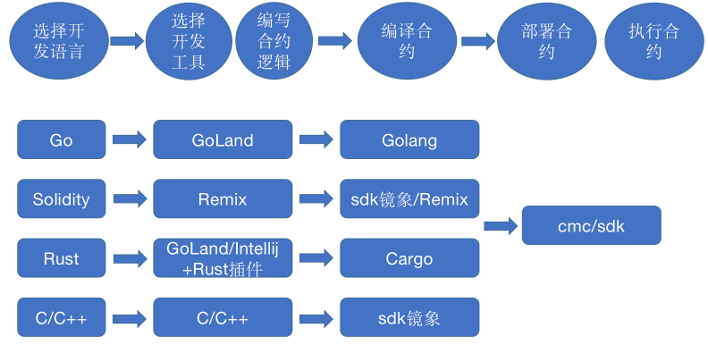

# 长安链智能合约开发整体介绍
作者：长安链团队 韩天乐

## 长安链智能合约简介
“长安链·ChainMaker”智能合约是运行在长安链上的一组“动态代码”。可以认为它是长安链上承载具体业务场景和逻辑的软件实现，特点是以长安链为执行的输入和输出环境，可以动态地部署和使用。目前长安链已经支持使用Golang、Rust、Solidity、TinyGo、C++进行智能合约开发，很快将支持Java。本章节将介绍各种语言合约的编写环境、编写、编译以及部署等相关知识。

“长安链·ChainMaker”的智能合约类型根据使用的运行时类型，整体上可以分为Wasm、Solidity和基于Docker运行的合约三个大类，其中Wasm类型的合约包含Rust、TinyGo和C++三种开发语言，这一类型的合约需要先将智能合约使用对应的工具编译成Wasm文件，然后进行部署和调用；Solidtiy合约和以太坊类似，先编译成Solidity字节码，然后再进行部署和调用；基于Docker类型的合约包括Golang和Java语言合约（Java语言的合约支持在开发中，后续可能会扩展更多其他合约语言），Go合约直接编译成平台机器码压缩后进行部署和调用，Java类型的合约也是编译成Java字节码进行部署和调用。三种类型合约的执行原理如下图：



“长安链·ChainMaker”官方当前推荐的合约编程语言依次为Golang、Rust、Solidity、TinyGo和C++。其中Golang合约编程限制少（除开发注意事项中的限制外，可以使用所有Go语言的特性），运行时环境DockerGo虚拟机也是长安链自研的支持微服务化部署的高性能虚拟机，为第一推荐编程语言。
## 智能合约的开发过程
“长安链·ChainMaker”智能合约的开发需要经过选择开发语言、开发工具、编写合逻辑代码、编译合约、部署合约和调用合约几个过程，长安链提供了整套合约开发过程推荐的工具，如下图所示：



## 智能合约开发注意事项
1. 智能合约中不要使用带有随机性的函数，以避免在不同的机器上合约执行结果不一致，从而导致交易无法达成共识，例如Golang常用的随机数函数包math/rand、获取系统时间的函数time.Now()和time.Date。
2. 智能合约中不要使用全局变量、静态变量，需要将合约的函数设计成无状态的，每次运行结果具有确定性，不依赖于全局变量或者静态变最，避免在不同的节点运行结果不一致，从而无法达成共识。
3. 智能合约中避免使用多线程（或者多协程），避免出现随机性，从而导致交易无法达成共识。
4. 使用Golang编写合约时，应避免在合约中捕获panic异常输出，合约进程如果panic，栈信息会自动输出到合约产生的log中去。
5. 在安装**CPP**智能合约时，要求共识节点、非共识节点必须安装GCC。
6. **TinyGo**对wasm的支持不太完善，对内存逃逸分析、GC等方面有不足之处，比较容易造成栈溢出。在开发合约时，应尽可能减少循环、内存申请等业务逻辑，使变量的栈内存地址在64K以内，要求tinygo version >= 0.17.0，推荐使用0.17.0。
7. **TinyGo**对导入的包支持有限，请参考：https://tinygo.org/lang-support/stdlib/，对列表中显示已支持的包，实际测试发现支持的并不完整，会发生一些错误，需要在实际开发过程中进行测试检验。
8. **TinyGo**引擎不支持`fmt`和`strconv`包。

## 智能合约开发语言和虚拟机

“长安链·ChainMaker”目前已经支持使用Golang、Rust、Solidity、TinyGo、C++进行智能合约开发，每种开发语言实现的合约由不同的虚拟机执行，在将合约发布到链上时通过Runtime Type来指定虚拟机类型，语言和类型的对应关系如下：

| 语言       | 类型                        |
|----------|---------------------------|
| 系统合约     | RuntimeType_NATIVE = 1    |
| Rust     | RuntimeType_WASMER = 2    |
| C++      | RuntimeType_WXVM = 3      |
| TinyGo   | RuntimeType_GASM = 4      |
| Solidity | RuntimeType_EVM = 5       |
| Golang   | RuntimeType_DOCKER_GO = 6 |

## 智能合约生命周期
长安链对智能合约有完善的生命周期管理，包括合约部署、升级、
合约可以使用命令行工具安装、调用、查询合约，请参看：[【命令行工具】](../dev/命令行工具.md)，也可使用SDK进行合约的安装、调用、查询，请参看：[【SDK】](../instructions/chainmaker-go-sdk.md)

## 合约和用户地址

**计算方式**

在区块链上，通常会有一个地址，作为用户或者合约在链上的唯一标识符。为了保证地址的唯一性，地址一般由哈希计算得到。一般来说，用户的地址根据公钥计算得到，而智能合约的地址由区块链自动生成。

在ChainMaker上，用户地址也是根据用户的公钥计算得到的，但合约地址，可以由链自动生成，也可以根据用户的合约名计算得到。且对于合约来说，ChainMaker支持合约名与合约地址两种方式调用。对于任意类型的合约，包括evm、wasmer、wxvm等等，ChainMaker部署合约时，都会将用户提供的合约名计算为合约地址，并在合约部署成功后将合地址放入contract对象内返回，用户反序列化contract对象就得到该合约的地址。

对于ChainMaker来说，当前支持以下三种地址类型：

- **CHAINMAKER**

  此地址格式为20字节数组，但一般会将其转换为可展示的16进制字符串，转换后长度为40字节，例如：`ce244336a16f64c5b6b27feae28a5ebd270be8ee`。CHAINMAKER对于公钥模式的用户来说，由于计算SKI稍显复杂，现已不推荐使用。

  - 用户地址——根据用户的SKI（SubjectKeyId）计算keccak256哈希，然后截取哈希值的后20字节，对外展示时，会再转换为十六进制字符串形式；
  - 合约地址——根据合约名计算keccak256哈希，然后截取哈希值的后20字节，对外展示时，会再转换为十六进制字符串形式。

- **ZXL**

  此地址类型，为至信链业务专用，不建议对外使用。ZXL的地址为20字节数组，转换为可展示的16进制字符串后，还会加一个字符串”ZX“作为前缀，长度变成了42字节，例如：`ZXd37af1a7fc2076a03184de539d5be976bd5c0688`。

  - 用户地址——对用户的公钥序列化后，计算sm3哈希，然后截取哈希值的前20字节，对外展示时，会再转换为十六进制字符串形式，并添加”ZX“前缀；
  - 合约地址——根据合约名计算sm3哈希，然后截取哈希值的前20字节，对外展示时，会再转换为十六进制字符串形式，并添加”ZX“前缀。

  ZXL与CHAINMAKER的主要区别是哈希算法不同，ZXL是sm3，CHAINMAKER是keccak256，另外，对于用户地址来说，计算所用的参数也不同，ZXL为序列化后的公钥，而CHAINMAKER为SKI，除此之外ZXL地址有”ZX前缀“。

- **ETHEREUM**

  此地址格式也是20字节数组，转换为可展示的16进制字符串后，一般会加一个”0x“前缀，长度也变成了42字节，例如：`0x7cf146966856b4899b4f25f169d81176d0942050`，但”0x“前缀非必须，可加可不加。

  - 用户地址——对用户公钥序列化后，计算keccak256哈希，然后截取哈希值的后20字节，对外展示时，会再转换为十六进制字符串形式；
  - 合约地址——根据合约名计算keccak256哈希，然后截取哈希值的后20字节，对外展示时，会再转换为十六进制字符串形式。

  ETHEREUM与CHAINMAKER非常相似，尤其对于合约地址，两者的参数和哈希算法都是相同的。但对于用户地址稍有不同，主要是地址的计算参数，ETHEREUM是序列化后的公钥，而CHAINMAKER为SKI，哈希算法仍然是相同的。

  ETHEREUM地址类型的优点是兼容以太坊地址类型，而且，也是ChainMaker的默认地址类型。

**配置**

在ChainMaker内，地址类型可以通过配置文件chainconfig/bc.yml内的addr_type字段指定，配置为0，是CHAINMAKER类型，1为ZXL类型，2为EHEREUM类型，默认配置类型为2，如下所示。

***chainconfig/bc.yml配置地址类型的片段***

```shell
......
# 虚拟机配置
vm:
  addr_type: 2 #0:chainmaker, 1:zxl, 2:ethereum
  # 虚拟机支持列表
  support_list:
......
```

**计算接口**

对于地址的计算，ChainMaker为开发者提供了统一的计算接口，这些接口统一放在了utils模块下的address.go原文件内（gitlab链接：https://git.code.tencent.com/ChainMaker/utils/blob/develop/address.go），开发者可通过导入该模块，并调用对应的接口计算地址，以保证接口计算的一致性。以下表格为地址计算接口展示。

***utils/address.go下提供的地址计算接口***

| 接口                                                         | 功能                                     |
| ------------------------------------------------------------ | ---------------------------------------- |
| func GenerateAddrStr(data []byte, addrType config.AddrType) (string, err) | 根据数据计算十六进制字符串类型的地址     |
| func GenerateAddrInt(data []byte, addrType config.AddrType) (big.Int, err) | 根据数据计算big.Int类型的地址            |
| func PkToAddrStr(pk crypto.PublicKey, addrType config.AddrType, hashType crypto.HashType)(string, err) | 根据公钥计算16进制字符串类型的地址       |
| func PkToAddrInt(pk crypto.PublicKey, addrType config.AddrType, hashType crypto.HashType)(big.Int, err) | 根据公钥计算big.Int类型的地址            |
| func CertToAddrStr(cert *x509.Certificate, addrType config.AddrType) (string, err) | 根据证书计算16进制字符串类型的地址       |
| func CertToAddrInt(cert *x509.Certificate, addrType config.AddrType)(big.Int, err) | 根据证书计算big.Int类型的地址            |
| func GetStrAddrFromMember(member protocol.Member, addrType config.AddrType) (string, err) | 根据member类型计算16进制字符串类型的地址 |
| func GetIntAddrFromMember(member protocol.Member, addrType config.AddrType) (big.Int, err) | 根据member类型计算big.Int类型的地址      |


