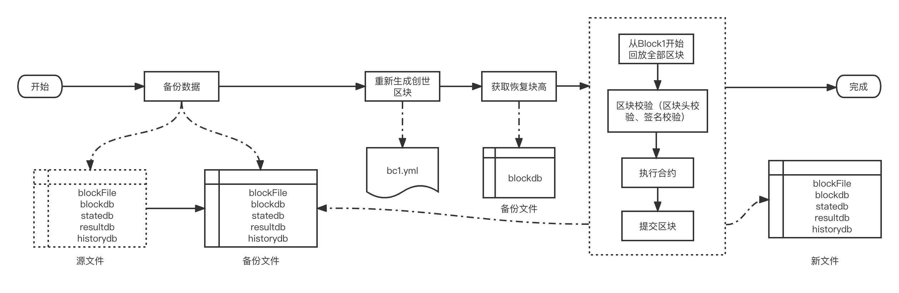

# 长安链数据管理
作者：长安链团队 曾毅

## 数据库的选型与配置

### 数据库选型
长安链数据库划分是按照存储数据的功能和特性分为以下几种数据库：
* BlockDB 存储区块与交易
* StateDB 存储最新的世界状态
* HistoryDB 存储状态变更历史，账户交易历史和合约调用历史，是可选的
* ResultDB 存储合约执行的读写集，是可选的
* ContractEventDB 存储合约事件日志数据库，是可选的

在数据持久化存储上，长安链支持常用的数据库来存储账本数据，如LevelDB、BadgerDB、TikvDB、MySQL等数据库，业务可选择其中任意一种数据库来部署区块链，每种数据库的简介如下：
- LevelDB，默认采用的数据库引擎，LevelDB作为一款嵌入式KV数据库，默认集成在长安链节点中，无需部署，性能也相对关系型数据要更好。
- BadgerDB，作为另一种形式的KV单机数据库的实现，也是嵌入式KV数据库，性能在写入value比较大时比LevelDB更高,但是读性能可能差于LevelDB
- TikvDB，作为KVDB的横向扩容版本，需要单独启动tikv服务，底层使用rocksdb,性能更高。[tikv部署流程](./Tikv安装部署.md)
- MySQL，关系型数据库，支持schema和富查询，性能较KV数据库低，目前关系型数据库与区块链的状态数据并不能很好的结合，导致很少有区块链采用关系型数据库作为状态数据库。原因主要有两点：1.区块链需要对智能合约所读写的状态数据做严格的控制和校验，而SQL语句相对区块链来说过于灵活，难以控制；2.需要提前创建库表和索引，需要针对不同的智能合约创建不同的数据库表结构，不够灵活。目前长安链支持MySQL存储引擎，在系统数据如Block DB上支持区块元信息、交易信息的关系型语义，状态数据库支持kv的方式和智能合约编写SQL语句方式读写状态数据(world state)。

### 数据库配置
长安链的数据库配置在chainmaker.yml中，具体如下：
```yml
storage:
  store_path: ../data/ledgerData  #账本的存储路径， 包括LevelDB、BadgerDB的数据目录，Block binary log的数据目录
  write_buffer_size: 4  #LevelDB的write_buffer_size， 单位为MB，默认为4M
  bloom_filter_bits: 10  #LevelDB的布隆过滤器参数，为每个key分配的额外bit空间，默认为10，如果少于或等于0，则不开启布隆过滤。
  disable_historydb: false  #是否禁用历史读写集的存储功能， 默认为false，也就是保存历史读写集。
  disable_block_file_db: false  #是否禁用区块文件存储功能， 默认为true，也就是未启用,新节点建议此处设置为false。
  logdb_segment_async: false  #区块文件异步落盘与否， 默认为false，也就是默认同步落盘，异步落盘时存在断电后数据损坏风险。
  logdb_segment_size: 128  #区块文件大小，单位MB，默认20MB。
  blockdb_config: #BlockDB 数据库配置
    provider: leveldb #数据库类型，支持LevelDB，BadgerDB，TikvDB，Mysql，这里示例为LevelDB
    leveldb_config: #LevelDB的详细配置
      store_path: ../data/org1/blocks
      write_buffer_size: 4	#LevelDB的write_buffer_size， 单位为MB，默认为4M
      bloom_filter_bits: 10	#LevelDB的布隆过滤器参数，为每个key分配的额外bit空间，默认为10，如果少于或等于0，则不开启布隆过滤。
  statedb_config: #StateDB 数据库配置
    provider: sql  #数据库类型，支持LevelDB，BadgerDB，TikvDB，Mysql，这里示例为Mysql
    sqldb_config: #SQL数据库的详细配置
      sqldb_type:  mysql #具体的RDBMS为mysql，也可以是sqlite、mssql等
      dsn:  root:password@tcp(127.0.0.1:3306)/ #MySQL的数据库连接字符串
      max_idle_conns: 10  #连接池中维持的最大的空闲连接数，默认为10
      max_open_conns: 10  #最大的可用连接数，默认为10
      conn_max_lifetime: 60  #连接维持的最长时间，单位秒，默认为60
  historydb_config: #HistoryDB数据库配置
    provider: badgerdb #数据库类型，支持LevelDB，BadgerDB，TikvDB，Mysql，这里示例为BadgerDB
    disable_key_history: false  #是否关闭对状态数据变更历史的记录
    disable_contract_history: true #是否关闭对合约历史的记录
    disable_account_history: true #是否关闭账户发起交易历史的记录
    badgerdb_config:
      store_path: ../data/org1/history
      compression: 0 # value为0 不压缩，1 Snappy压缩，2 ZSTD压缩，默认为0
      value_threshold: 10240 # 单位为bytes，默认为10240 bytes
  resultdb_config: #ResultDB数据库配置
    provider: tikvdb # 支持LevelDB，BadgerDB，TikvDB，Mysql
    tikvdb_config:
       endpoints: "127.0.0.1:2379" # tikv pd server url，支持多个url， 如: "192.168.1.2:2379,192.168.1.3:2379"
       max_batch_count: 128 # 每次kv batch最大大小 默认128
       grpc_connection_count: 4 # chainmaker连接tikv的连接数， 默认4
       grpc_keep_alive_time: 10 # 保持连接的连接数， 默认10
       grpc_keep_alive_timeout: 3 # 保持连接的超时时间 默认3
       write_batch_size: 128 # 每次提交tikv批次最大大小，默认128
  disable_contract_eventdb: true  #是否禁止合约事件存储功能，默认为true，如果设置为false,需要配置mysql
  contract_eventdb_config:
    provider: sql                 #如果开启contract event db 功能，需要指定provider为sql
    sqldb_config:
      sqldb_type: mysql           #contract event db 只支持mysql
      dsn: root:password@tcp(127.0.0.1:3306)/  #mysql的连接信息，包括用户名、密码、ip、port等，示例：root:admin@tcp(127.0.0.1:3306)/
```

在区块链数据不到1T的情况下，建议使用LevelDB作为默认的数据库；如果状态数据中存储了大量上KB级别的Value，可以将BadgerDB作为状态数据库的底层；如果预期数据量上T甚至更多，则建议采用TiKV作为默认的数据库底层；如果支持的业务复杂，合约需要大量富查询和各个字段的索引查询，汇总等，建议采用MySQL作为状态数据库底层，并且使用SQL语句来编写智能合约。

在选择了不同的数据库作为provider后，其后续的子配置项就是这个数据库的参数配置，比如provider: leveldb，那么后续子配置项就是leveldb_config，其中store_path是最重要的配置参数，其他选型可以采用默认值即可，除非您非常明确这个选项对数据库的影响。

如果出于性能的考虑，可以关闭HistoryDB、ResultDB和ContractEventDB，这些数据库可以帮忙开发者查询更详细的记录，用于区块链浏览器或者数据分析的情况。

<span id="archive"></span>

## 数据归档&恢复功能

cmc的归档功能是指将链上数据转移到独立存储上，归档后的数据具备可查询、可恢复到链上的特性。
为了保持数据一致性和防止误操作，cmc实现了分布式锁，同一时刻只允许一个cmc进程进行转储。
cmc支持增量转储和恢复、断点中继转储和恢复，中途退出不影响数据一致性。

> 注意：mysql需要设置好 sql_mode 以root用户执行 set global sql_mode = ‘ONLY_FULL_GROUP_BY,STRICT_TRANS_TABLES,ERROR_FOR_DIVISION_BY_ZERO,NO_ENGINE_SUBSTITUTION’;

主要参数说明如下：

```sh
  --sdk-conf-path：指定cmc使用sdk的配置文件路径
  --chain-id：指定链Id
  --type：指定链下独立存储类型，如 --type=mysql 默认mysql，目前只支持mysql
  --dest：指定链下独立存储目标地址，mysql类型的格式如 --dest=user:password:localhost:port
  --target：指定转储目标区块高度，在达到这个高度后停止转储(包括这个块) --target=100
  	也可指定转存目标日期，转储在此日期之前的所有区块 --target="2021-06-01 15:01:41"
  --blocks：指定本次要转储的块数量，注意：对于target和blocks这两个参数，cmc会就近原则采用先符合条件的参数
  --start-block-height：指定链数据恢复时的起始区块高度，如设置为100，则从已转储并且未恢复的最大区块开始降序恢复链数据至第100区块
  --secret-key：指定密码，用于链数据转储和链数据恢复时数据一致性校验，转储和恢复时密码需要一致
```

 

- 根据时间转储，将链上数据转移到独立存储上，需要权限：sdk配置文件中设置与归档节点同组织的

  admin用户

  ```sh
  ./cmc archive dump --type=mysql \
  --dest=root:password:localhost:3306 \
  --target="2021-06-01 15:01:41" \
  --blocks=10000 \
  --chain-id=chain1 \
  --sdk-conf-path=./testdata/sdk_config_pwk.yml \
  --secret-key=mypassword
  ```

- 根据区块高度转储，将链上数据转移到独立存储上，需要权限：sdk配置文件中设置与归档节点同组织的

  admin用户

  ```sh
  ./cmc archive dump --type=mysql \
  --dest=root:password:localhost:3306 \
  --target=100 \
  --blocks=10000 \
  --chain-id=chain1 \
  --sdk-conf-path=./testdata/sdk_config_pwk.yml \
  --secret-key=mypassword
  ```

- 恢复，将链下的链数据恢复到链上，需要权限：sdk配置文件中设置与归档节点同组织的

  admin用户

  ```sh
  ./cmc archive restore --type=mysql \
  --dest=root:password:localhost:3306 \
  --start-block-height=0 \
  --chain-id=chain1 \
  --sdk-conf-path=./testdata/sdk_config_pwk.yml \
  --secret-key=mypassword
  ```

- 根据区块高度查询链下已归档区块

  ```sh
  ./cmc archive query block-by-height [blockheight] \
  --chain-id=chain1 \
  --sdk-conf-path=./testdata/sdk_config_pwk.yml \
  --type=mysql \
  --dest=root:password:localhost:3306
  ```

- 根据区块hash查询链下已归档区块

  ```sh
  ./cmc archive query block-by-hash [blockhash] \
  --chain-id=chain1 \
  --sdk-conf-path=./testdata/sdk_config_pwk.yml \
  --type=mysql \
  --dest=root:password:localhost:3306
  ```

- 根据txid查询链下已归档区块

  ```sh
  ./cmc archive query block-by-txid [txid] \
  --chain-id=chain1 \
  --sdk-conf-path=./testdata/sdk_config_pwk.yml \
  --type=mysql \
  --dest=root:password:localhost:3306
  ```

- 根据txid查询链下已归档tx

  ```sh
  ./cmc archive query tx [txid] \
  --chain-id=chain1 \
  --sdk-conf-path=./testdata/sdk_config_pwk.yml \
  --type=mysql \
  --dest=root:password:localhost:3306
  ```

## 数据重建(rebuild_dbs)

当因为操作不当，恶意篡改等原因，导致状态数据库的数据与区块链历史数据或其他节点不一致，那么就意味着状态数据库损坏，需要利用账本数据进行数据重建。重建过程如下：


1. 操作步骤 
   1. 停止区块链服务
   2. 执行数据恢复（执行过程如上图），示例如下
    ```
    ./chainmaker rebuild-dbs -c ../config/wx-org1-solo/chainmaker.yml
    ```
   3. 查看日志，确认恢复成功

2. 使用限制
   1. 当前仅支持leveldb存储方式的恢复

3. 其他
   1. 执行数据恢复，会自动备份原数据
   2. 可以配置恢复区块高度，不配置则恢复全部
    ```
    storage:
      rebuild_block_height: 10
    ```
   3. 可以在命令行末尾添加chainid来指定恢复的chainid
      ```
      ./chainmaker rebuild-dbs -c ../config/wx-org1-solo/chainmaker.yml ci-solo --chain-id=chain1
      ```
   4. 可以在命令行末尾添加need-verify，对于可靠的数据恢复原始数据跳过区块验证过程，提高恢复速度，默认true
      ```
      ./chainmaker rebuild-dbs -c ../config/wx-org1-solo/chainmaker.yml ci-solo --chain-id=chain1 --need-verify=false
      ```
4. 用法
    1. 数据库恢复: 在数据库数据损坏时，使用block和ledgerData1文件夹的数据，可以重新生成其他文件夹的数据
    2. 数据同步: 在同步过程中，可以拷贝目标节点的block和ledgerData1数据，然后使用该工具在本地重新生成其他文件夹的数据，之后即可以快速启动链，达到快速同步的效果
    3. 回滚链到指定高度: 在最新数据写入紊乱，数据库不可用时，也可以使用该工具恢复到数据未紊乱时的高度，达到数据回滚的效果

