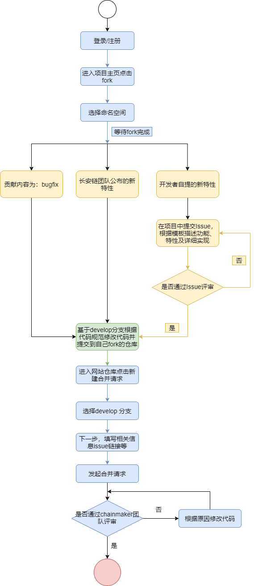

# 贡献代码管理规范及流程
作者：长安链团队


## ChainMaker 注释编写规范

1. 在编码阶段同步写好变量、函数、文件注释、包注释，注释可以通过 `godoc` 导出生成文档。
2. 程序中每一个被导出的(大写的)名字，都应该有一个文档注释。
3. 所有注释掉的代码在提交 code review 前都应该被删除，除非添加注释讲解为什么不删除， 并且标明后续处理建议（比如删除计划）。

### 【必须】包注释

- 每个包都应该有一个包注释。

- 包如果有多个 go 文件，只需要出现在一个 go 文件中（一般是和包同名的文件）即可，格式为：“// Package 包名 包信息描述”。

  ```javascript
  // Package math provides basic constants and mathematical functions.
  package math
  
  // 或者
  
  /*
  Package template implements data-driven templates for generating textual
  output such as HTML.
  ....
  */
  package template
  ```

### 【必须】文件注释

- 每个文件都必须有一个文件注释；

- 文件头需要写明license和文件描述。其中license如下：

  ```go
  /*
  Copyright (C) The ChainMaker Authors
  
  SPDX-License-Identifier: Apache-2.0
  
  @Description 该文件中实现了合约相关命令行查询功能具体包括：
  	1.按合约名字查询合约对象
  	2.查询所有的合约列表
  	3.查询被禁用的系统合约
  */
  ```

### 【必须】结构体注释

- 每个需要导出的自定义结构体或者接口都必须有注释说明。

- 注释对结构进行简要介绍，放在结构体定义的前一行。

- 格式为："// 结构体名 结构体信息描述"。

- 结构体内的可导出成员变量名，如果是个生僻词，或者意义不明确的词，就必须要给出注释，放在成员变量的前一行或同一行的末尾。

  ```javascript
  // User 用户结构定义了用户基础信息
  type User struct {
      Name  string
      Email string
      // Demographic 族群
      Demographic string
  }
  ```

  

### 【必须】方法注释

- 每个需要导出的函数或者方法（结构体或者接口下的函数称为方法）都必须有注释。注意，如果方法的接收器为不可导出类型，可以不注释，但需要质疑该方法可导出的必要性。

- 注释描述函数或方法功能、调用方等信息。

- 格式为："// 函数名 函数信息描述"。

  ```javascript
  // NewtAttrModel 是属性数据层操作类的工厂方法
  func NewAttrModel(ctx *common.Context) *AttrModel {
      // TODO
  }
  ```

  

- 例外方法：

- Write Read 用于常见IO

- ServeHTTP 用于HTTP服务

- String 用于打印

- Unwrap Error 用于错误处理

- Len Less Swap 用于排序

### 【必须】变量和常量注释

- 每个需要导出的常量和变量都必须有注释说明。

- 该注释对常量或变量进行简要介绍，放在常量或者变量定义的前一行。

- 大块常量或变量定义时，可在前面注释一个总的说明，然后每一行常量的末尾详细注释该常量的定义。

- 格式为："// 变量名 变量信息描述"，斜线后面紧跟一个空格。

  ```javascript
  // FlagConfigFile 配置文件的命令行参数名
  const FlagConfigFile = "--config"
  
  // 命令行参数
  const (
      FlagConfigFile1 = "--config" // 配置文件的命令行参数名1
      FlagConfigFile2 = "--config" // 配置文件的命令行参数名2
      FlagConfigFile3 = "--config" // 配置文件的命令行参数名3
      FlagConfigFile4 = "--config" // 配置文件的命令行参数名4
  )
  
  // FullName 返回指定用户名的完整名称
  var FullName = func(username string) string {
      return fmt.Sprintf("fake-%s", username)
  }
  ```

  

### 【必须】类型注释

- 每个需要导出的类型定义（type definition）和类型别名（type aliases）都必须有注释说明。

- 该注释对类型进行简要介绍，放在定义的前一行。

- 格式为："// 类型名 类型信息描述"。

  ```javascript
  // StorageClass 存储类型
  type StorageClass string
  
  // FakeTime 标准库时间的类型别名
  type FakeTime = time.Time
  ```

  

## 注释相关工具

### godoc和pkgsite

```javascript
go install  golang.org/x/tools/cmd/godoc@latest
godoc -http=:6060
```

pkgsite的用法类似

```javascript
go install golang.org/x/pkgsite/cmd/pkgsite@latest
pkgsite -http=:6060
```

然后打开浏览器访问 http://localhost:6060/chainmaker.org/chainmaker/xxxx/v2 即可查看web文档

### Goland插件Goanno

Goanno插件可以提供自动生成Go代码注释的模板，然后开发人员根据模板填写入完整注释即可。
安装好Goanno插件后，Tool->Goanno Setting可以设置模板

### golangci-lint检查

请下载[.golangci.yml](https://git.chainmaker.org.cn/chainmaker/chainmaker-tools/-/blob/master/golangci/.golangci.yml)文件，这个文件放到$GOPATH/src/chainmaker.org目录，或者需要进行lint检查某个项目文件夹下，然后下载安装golangci-lint（下载地址：https://github.com/golangci/golangci-lint ），然后在需要lint检查的某个项目仓库文件夹下执行命令
`golangci-lint run ./...`
即可对该文件夹中的源码进行lint检查。

### gocloc注释覆盖率计算

注释覆盖率才采用gocloc这个工具进行计算，安装命令：
`go install github.com/hhatto/gocloc/cmd/gocloc@latest`
安装后执行命令：
`gocloc --include-lang=Go --output-type=json --not-match=_test.go . | jq '(.total.comment-.total.files*6)/(.total.code+.total.comment)*100'`

### 包注释规则

- 注释必连续，如果有段落，段落之间的空行也需要注释，否则会被godoc忽略
- 包注释以Package packagename开头，应尽量简短，如果比较长，放在包的doc.go文件中

### 代码注释规则

- type, const, function, var注释以名称开头，紧临代码来写，函数注释描述函数的功能、参数和返回值，调用注意事项等

- 特殊开头的关键字：

BUG(who) ：描述函数未解决的bug

TODO: 描述待处理事项，godoc命令生成时需要指定--note关键字

Deprecated：已废弃，只为了保持兼容，写明代替方式

- 段落用空行注释表示

- 预格式化（缩进）可以被识别为代码块，

示例：


展示效果


### Example文件规则

- Example文件和代码放在同一个文件夹下，文件名以example_开头，以_test结尾，如example_xxx_test.go，example的包名也是以example_开头，以_test结尾，如package example_xxx_test.

- Example函数名以Example开头，格式是Example[function name]_[tag]，如果没有函数名，Example会被展示在OverView，如果有function name，会被展示在函数说明里。

- Example 输出用关键字写在函数结尾处

示例：


展示效果：


参考资料：

<a href="https://blog.golang.org/godoc" taget="_blank">https://blog.golang.org/godoc</a>


## ChainMaker Git库代码管理规范

### 提交规范

格式： [option] [(fileName or moduleName)] :   [msg]

示例：fix(main.go): line 25 ,  return value of `txContext.Get` is not checked

	feat: 新特性
	fix: bug修复
	docs: 文档修改
	style: 格式、缺少分号、换行等；无生产代码更改
	refactor: 重构代码，例如重命名变量、结构
	test: 添加缺失的测试，重构测试；无生产代码更改
	chore: 其他杂项

### Git仓库的目录结构

在Git仓库中，除了存放源码外，还需要将自动化测试代码、脚本和配置文件也放在该库中，同源管理。

```sh
Project
|----conf
|----test
|----....
|----....
```

**1.conf目录下存放配置项**

**配置项可分为：**

1) 环境配置项
与所运行的环境有关，例如：域名、其他系统的地址和端口等。

2) 应用配置项
信息安全控制和应用程序自身有关，例如：账号密码、初始分配内存大小、数据库连接池大小等。

3) 业务配置项
与应用程序执行的业务行为相关，每个设置有个默认值。例如，功能特性开关。

根据使用时机不同，可将这些配置项分为：构建时、部署时和运行时配置。 构建时和部署时配置相当于静态配置，通常和环境相关。

**conf目录下的推荐结构**：

```sh
config
|-----dev
|-----test
|-----prod
```

**2.test目录下存放自动化测试代码。**

**3.Git的大文件管理**

代码库中超过100MB的二进制文件推荐进行大文件管理。超过500MB的二进制文件必须进行大文件管理。

**4.Git的忽略列表**

根据项目类型设置Git的忽略文件列表，可参考：<a href="https://github.com/github/gitignore" target="_blank">各类语言模版</a>

## ChainMaker 贡献代码规范

- 需满足上方介绍的注释规范；
- 需满足上方介绍的golangci-lint检查，并于提交合并时粘贴截图；
- 需满足上方介绍注释覆盖率大于15%，并于提交合并时粘贴截图；
- 需满足上方介绍的目录结构规范；
- 合并请求需合入develop分支。

## ChainMaker 贡献代码流程

<a href="https://git.chainmaker.org.cn/" target="_blank">长安链官方仓库</a>： <a href="https://git.chainmaker.org.cn/" target="_blank">https://git.chainmaker.org.cn/</a>

1. 注册/登录
2. fork需要贡献的chainmaker项目
3. 提交代码到自己空间的项目
4. 创建合并请求到chainmaker空间项目的develop分支
5. 等待反馈，合并完成


