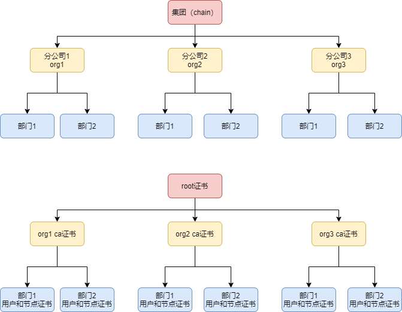
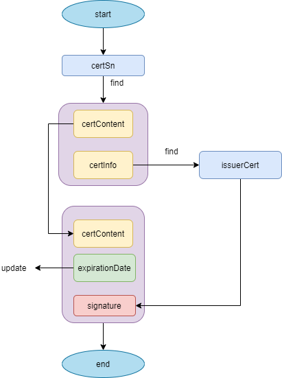
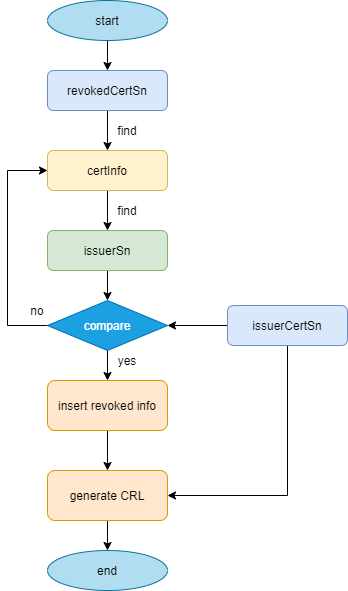
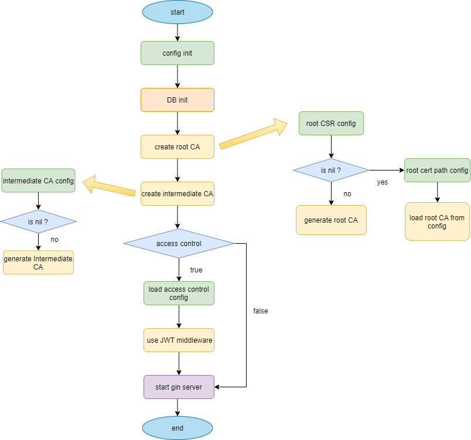

# CA证书服务
作者：长安链团队 刘鑫峰

## 证书简介

ChainMaker区块链网络中使用的证书类型有三大类 `CA证书` `节点证书` `用户证书`。<br>
`CA证书`: 可以是根CA证书、中间CA证书、自签CA证书，其余两类证书都是使用`CA证书`签名生成。<br>
`节点证书`: 细分为共识节点、同步节点、轻节点使用的证书。同步节点和轻节点证书类型相同。<br>
`用户证书`: 细分为管理员用户证书、普通用户证书。分别对应管理员权限和普通用户权限。<br>
下面详细介绍ChainMaker网络中各类证书。

## 证书
- [CA证书](#rootCert)
- [节点证书类](#nodeCert)
- [用户证书类](#userCert)

<span id="rootCert"></span>
### CA证书

一般每个组织一个`CA证书`。<br>
`CA证书`可通过 [chainmaker-cryptogen](../dev/证书生成工具.md) 或者自建的 [CA证书服务](./CA证书服务.md) 生成，也可通过向证书颁发机构申请获得。<br>
本组织的所有`节点证书`以及`用户证书`都是由此`CA证书`签发生成。<br>

<span id="nodeCert"></span>
### 节点证书类

每个组织至少有一个共识节点，也可以部署多个。<br>
每个组织可以有若干同步和轻节点，也可以不部署。<br>
不管什么类型的节点，每个节点都会有一个`节点TLS证书`和一个`节点SIGN证书`，其证书字段详见[节点证书、用户证书字段](#certFields)<br><br>

- 共识节点
  - 节点TLS证书

    用于跟客户端建立tls链接，使用`CA证书`签发获得，证书字段信息如下示例：<br>
    ```shell
    O=wx-org1.chainmaker.org
    OU=consensus // 共识节点证书必须为consensus
    CN=consensus1.wx-org1.chainmaker.org
    sans=localhost // 用于tls的证书sans字段必填
    ```

  - 节点SIGN证书

    用于签名验签等等，使用`CA证书`签发获得，证书字段信息如下示例：<br>
    ```shell
    O=wx-org1.chainmaker.org
    OU=consensus // 共识节点证书必须为consensus
    CN=consensus1.wx-org1.chainmaker.org
    ```
  
- 同步节点、轻节点

  同步节点与轻节点的证书规格完全一致，以下示例都互相适用，不再重复举例。

  - 节点TLS证书

    用于跟客户端建立tls链接，使用`CA证书`签发获得，证书字段信息如下示例：<br>
    ```shell
    O=wx-org1.chainmaker.org
    OU=common // 同步节点/轻节点证书必须为common
    CN=consensus1.wx-org1.chainmaker.org
    sans=localhost // 用于tls的证书sans字段必填
    ```

  - 节点SIGN证书

    用于签名验签等等，使用`CA证书`签发获得，证书字段信息如下示例：<br>
    ```shell
    O=wx-org1.chainmaker.org
    OU=common // 同步节点/轻节点证书必须为common
    CN=consensus1.wx-org1.chainmaker.org
    ```

<span id="userCert"></span>
### 用户证书类

用户证书类分为`admin证书类`分配给管理员用户使用和`client证书类`分配给普通用户使用。<br>
每个组织至少有一个管理员用户和若干个普通用户<br>
不管什么类型的用户，每个用户都会有一个`用户TLS证书`和一个`用户SIGN证书`，其证书字段详见[节点证书、用户证书字段](#certFields)<br><br>

- admin证书类
  - 用户TLS证书

    用于跟节点建立tls链接，使用`CA证书`签发获得，证书字段信息如下示例：<br>
    ```shell
    O=wx-org1.chainmaker.org
    OU=admin // 管理员用户必须为admin
    CN=admin1.wx-org1.chainmaker.org
    ```

  - 用户SIGN证书

    用于签名验签等等，使用`CA证书`签发获得，证书字段信息如下示例：<br>
    ```shell
    O=wx-org1.chainmaker.org
    OU=admin // 管理员用户必须为admin
    CN=admin1.wx-org1.chainmaker.org
    ```
  
- client证书类
  - 用户TLS证书

    用于跟节点建立tls链接，使用`CA证书`签发获得，证书字段信息如下示例：<br>
    ```shell
    O=wx-org1.chainmaker.org
    OU=client // 普通用户必须为client
    CN=client1.wx-org1.chainmaker.org
    ```

  - 用户SIGN证书

    用于签名验签等等，使用`CA证书`签发获得，证书字段信息如下示例：<br>
    ```shell
    O=wx-org1.chainmaker.org
    OU=client // 普通用户必须为client
    CN=client1.wx-org1.chainmaker.org
    ```

## 链上变更
### 组织CA证书类
- [使用cmc新增组织CA证书](../dev/命令行工具.html#chainConfig.addOrgRootCA)
- [使用cmc删除组织CA证书](../dev/命令行工具.html#chainConfig.delOrgRootCA)
- [使用cmc更新组织CA证书](../dev/命令行工具.html#chainConfig.updateOrgRootCA)

## 附录
<span id="certFields"></span>
### 节点证书、用户证书字段

节点证书和用户证书字段通用

| 字段 | 含义 | 规范 |
| :----: | :----: | :----: |
| C | country 国家 | 如：CN |
| L | locality 位置(城市) | 如：Guangzhou |
| ST | state 省份(州) | 如：Guangdong |
| O | organization 组织 | 对应chainmaker的组织ID（orgId）如：wx-org1.chainmaker.org |
| OU | organizationalUnit 组织单位 | 对应chainmaker里的用户角色：consensus/common/admin/client |
| CN | commonName 常用名 | chainmaker里通常以用户ID+组织ID形式，如：ca.wx-testorg.chainmaker.org、admin1.wx-org1.chainmaker.org、consensus1.wx-org1.chainmaker.org、client1.wx-org1.chainmaker.org |
| expireYear | 证书有效期 | 以年为单位 如：2 |
| sans | 节点证书的地址信息 | 可为节点地址IP，也可以是节点域名 如：consensus1.wx-org1.chainmaker.org |

<br><br>


## CA证书服务概述

长安链证书签发服务，可用于多种场景部署，提供证书签发，管理，更新，吊销等服务。

CA证书服务的使用手册链接：

[CA证书服务的使用手册](../operation/CA证书服务.md)


## 表设计

### cert_content

证书的内容表，存储写到X509证书里的证书详情。

|        字段         |     类型     |          含义          |           备注           |
| :-----------------: | :----------: | :--------------------: | :----------------------: |
|    serial_number    |    bigint    |          SN码          | 证书字段，证书的唯一标识 |
|       content       |   longtext   |       证书的内容       |         pem编码          |
|      signature      |   longtext   |       证书的签名       |         hex编码          |
|       country       | varchar(255) |          国家          |       X509证书字段       |
|      locality       | varchar(255) |          地区          |       X509证书字段       |
|      province       | varchar(255) |          省份          |       X509证书字段       |
|    organization     | varchar(255) |          组织          |       X509证书字段       |
| organizational_unit | varchar(255) |          单位          |       X509证书字段       |
|     common_name     | varchar(255) |         常用名         |       X509证书字段       |
|     csr_content     |   longtext   |       证书的csr        |         pem编码          |
|        is_ca        |     bool     |  证书是否具有签发能力  |       X509证书字段       |
|         ski         | varchar(255) |     证书密钥的ski      |       X509证书字段       |
|         aki         | varchar(255) |     证书密钥的aki      |       X509证书字段       |
|      key_usage      |     int      |   证书密钥的使用方式   |       X509证书字段       |
|    ext_key_usage    | varchar(255) | 证书密钥的扩展使用方式 |       X509证书字段       |
|     issue_date      |    bigint    |        签发日期        |        unix时间戳        |
|   expiration_date   |    bigint    |        到期时间        |        unix时间戳        |

### cert_info

证书的相关信息表，存储与证书相关的，包括密钥，用户信息等。

|      字段      |     类型     |     含义     |          备注          |
| :------------: | :----------: | :----------: | :--------------------: |
| serial_number  |    bigint    |    证书sn    |    证书的唯一标识sn    |
| private_key_id | varchar(255) |   私钥标识   |    一般为私钥的ski     |
|   issuer_sn    |    bigint    |   签发者sn   |   该证书的颁发者的sn   |
|  p2p_node_id   | varchar(255) |  p2p网络Id   |  长安链P2P网络节点ID   |
|     org_id     | varchar(255) | 组织唯一标识 |      长安链组织ID      |
|   user_type    |     int      | 证书用户类型 |     长安链证书角色     |
|   cert_usage   |     int      |   证书用途   |   长安链证书使用方式   |
|    user_id     | varchar(255) | 用户唯一标识 | 长安链用户（节点）标识 |

* user_type: 1.root , 2.ca , 3.admin , 4.client , 5.consensus , 6.common

* cert_usage: 1.sign , 2.tls , 3.tls-sign , 4.tls-enc

### keypair

公私钥对表，存储密钥的具体信息。

|    字段     |     类型     |    含义    |          备注          |
| :---------: | :----------: | :--------: | :--------------------: |
|     ski     | varchar(255) | 密钥的ski  | 密钥在证书里的唯一标识 |
| private_key |   longtext   | 私钥的内容 |        pem编码         |
| public_key  |   longtext   | 公钥的内容 |        pem编码         |
|  key_type   |     int      |  公钥算法  |                        |
|  hash_type  |     int      |  哈希算法  |                        |

### revoked_cert

撤销的证书表，存储撤销信息。

|        字段        |     类型     |     含义     |
| :----------------: | :----------: | :----------: |
|  revoked_cert_sn   |    bigint    | 撤销证书的SN |
|       reason       |   longtext   |   撤销原因   |
| revoked_start_time |    bigint    | 撤销开始时间 |
|  revoked_end_time  |    bigint    | 撤销结束时间 |
|     revoke_by      |    bigint    |    撤销者    |
|       org_id       | varchar(255) |   所属组织   |

### app_info

访问控制应用信息表，存储配置的应用id和key还有角色。

|   字段   |     类型     |   含义   |
| :------: | :----------: | :------: |
|  app_id  | varchar(255) |  应用id  |
| app_key  | varchar(255) | 应用口令 |
| app_role |     int      | 应用角色 |

app_role : 1.admin , 2.user

* admin : 所有权限

* user ：不能进行吊销、延期证书。只能申请，查询证书。

## 证书详解

### 证书使用方式

* sign ：签名证书。
* tls ：tls 证书
* tls-enc ：tls加密证书（符合国密tls双证书标准）
* tls-sign ：tls签名证书（符合国密tls双证书标准）

### 证书分类

* **CA证书**

  CA证书是指具有签发能力的证书，即使用该证书可以继续签发下级证书。通常为root或者ca两种证书角色。

* **用户证书**

  用户证书是指不具备签发能力的、给用户使用的tls或sign证书。通常为admin或client两种角色。

* **节点证书**

  节点证书是指不具备签发能力的、给节点使用的tls或sign证书。通常为consensus或common两种角色。

### 证书角色分类

* **root**

  root为根证书。即初始证书，是由自签形成的第一个证书。

* **ca**

  ca为中间CA证书。该类证书是由根证书直接或间接签发，本身也具有继续向下签发的能力。在ChainMaker中，通常表现为组织证书。

* **admin**

  admin为用户证书的一种。通常称为管理员证书。该证书拥有参与投票等更多的参与权限。（想要了解具体权限设计详情，请查看长安链开源文档，用户手册的权限管理模块。）

* **client**

  client为用户证书的一种。通常称为普通用户证书。该证书拥有发起交易，查询信息等基本的链上操作权限。但缺乏参与投票等一些重大决策权限。（想要了解具体权限设计详情，请查看长安链开源文档，用户手册的权限管理模块。）

* **consensus**

  consensus为节点证书的一种。通常称为共识节点证书。该证书通常颁发给ChainMaker的共识节点，共识节点用共识节点证书参与链上的共识投票、签名、校验、通信等操作。

* **common**

  common为节点证书的一种。通常称为同步节点证书。该证书通常颁发给ChainMaker的同步节点，同步节点的校验，签名、通信的操作需要同步节点的tls和sign证书。


### 场景模拟




该场景下，以集团为基础，以多个分公司为参与方构建一条区块链。

分公司在链上是组织的身份。分公司下的部门，在链上是用户和节点的身份。

在这种场景下，集团以root证书的身份给所有分公司颁发中间ca证书（组织证书）。

分公司用各自的中间ca证书给自己的部门颁发用户和节点证书。

### X.509证书字段规范

在ChainMaker证书体系里，X.509证书格式的以下字段做出了具体的规范：

#### 常用字段

|       字段       | 证书类型 |        全称        |    填写内容     |              含义              |
| :--------------: | :------: | :----------------: | :-------------: | :----------------------------: |
|        O         |   统一   |    Organization    |      OrgId      | 组织ID<br />（组织的唯一标识） |
|        OU        |   统一   | OrganizationalUnit |  证书角色类型*  |              角色              |
|        CN        |  CA证书  |     CommonName     |     root/ca     |                                |
|        CN        | 用户证书 |     CommonName     |     UserId      |  用户ID<br />（用户唯一标识）  |
|        CN        | 节点证书 |     CommonName     | xxx.xxx.xxx.com |    节点真实域名（链上唯一）    |
| DNSNames（SANS） | 节点证书 |      DNSNames      | xxx.xxx.xxx.com |          节点真实域名          |

***证书角色类型**：root/ca/admin/client/consensus/common 共六种选择。

* O字段，即X.509证书的Organization字段，我们要求所有证书必须填写组织的唯一标识，需要与ChainMaker启动时配置的OrgId统一。
* OU字段，即X.509证书的OrganizationalUnit字段，我们要求所有证书必须填写ChainMaker证书6种角色的其中一种。
* CN字段，即X.509证书的CommonName字段，CA证书根据实际的证书角色填写root或者ca。用户证书填写用户的唯一标识，UserId。节点证书填写节点的真实域名信息。同一节点（用户）的tls和sign证书，CN字段应该相同。
* DNSNames字段，节点证书填写节点的真实域名信息，其余不作要求。

#### KeyUsage

X.509的KeyUsage字段，具体用法介绍请参照RFC 5280标准

根据证书角色和证书的使用方式，我们对字段KeyUsage进行了具体设定：

* **admin/client/consensus/common :**

  * **tls-sign :** x509.KeyUsageDigitalSignature  | x509.KeyUsageContentCommitment

  * **tls-enc :** x509.KeyUsageKeyEncipherment | x509.KeyUsageDataEncipherment | x509.KeyUsageKeyAgreement

  * **tls:** x509.KeyUsageKeyEncipherment | x509.KeyUsageDataEncipherment | x509.KeyUsageKeyAgreement |x509.KeyUsageDigitalSignature | x509.KeyUsageContentCommitment

  * **sign :** x509.KeyUsageDigitalSignature | x509.KeyUsageContentCommitment

* **ca/root :** 

  * **tls :**  x509.KeyUsageCertSign | x509.KeyUsageCRLSign

  * **sign :** x509.KeyUsageCertSign | x509.KeyUsageCRLSign

#### ExtKeyUsage

X.509的ExtKeyUsage字段，具体用法介绍请参照RFC 5280标准

根据证书角色和证书的使用方式，我们对字段KeyUsage进行了具体设定：

* **consensus/common :**

  * **tls:** {ExtKeyUsageServerAuth, ExtKeyUsageClientAuth}

  * **tls-enc:** {ExtKeyUsageServerAuth, ExtKeyUsageClientAuth}

  * **tls-sign:** {ExtKeyUsageServerAuth, ExtKeyUsageClientAuth}

* **admin/client：**

  * **tls:** {ExtKeyUsageClientAuth}

  * **tls-sign:** {ExtKeyUsageClientAuth}

  * **tls-enc:** {ExtKeyUsageClientAuth}


## 证书延期

通过提供的证书SN，找到旧证书，在旧证书的基础上，以旧证书的信息为基础，包括SN字段，在旧证书的有效期基础上，用该证书的签发者，重新签名签发延期证书。

流程：





## 证书撤销

首先判断签发者SN是否是要撤销证书的上级，如果是，将撤销信息插入数据库保存。撤销日期以撤销动作起，到证书的失效期结束（永久吊销）。然后，生成该签发者证书下所有撤销的证书列表（CRL）并返回。

流程：




## 服务启动

流程：



