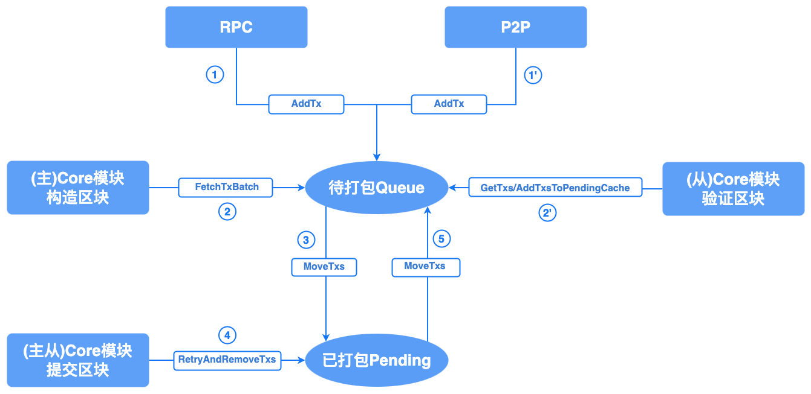

# 核心交易流程说明
作者：长安链团队 刘志旺

## 并行调度

不同于传统的块内交易串行执行的机制，并行调度指节点在产块验块阶段使用并行调度算法执行块内交易，充分利用了多核CPU的优势，极大地加速了区块链的整体处理性能。

### 并行调度算法分类

根据对同一批交易调度产生的执行顺序是否随机，并行调度算法可分为：

- `随机性调度算法`：即针对同一批交易调度产生的交易执行顺序是随机的，即使同一节点针对同一批交易连续运行两次调度算法产生的结果也可能不同。此类算法往往调度速度较快，其难点在于验证节点如何保证执行顺序与提案节点一致并得到相同的执行结果。因此，交易的执行顺序必须打包至区块中并由其他节点据此验证。

- `确定性调度算法`：即针对同一批交易调度产生的交易执行顺序是确定的。此类算法的优点是交易执行顺序产生稳定且可复现，因此理论上讲交易执行顺序的信息可不包含在区块内，各验证节点运行并行调度算法即可进行校验。

### 长安链并行调度算法

长安链自版本1.0.0就提供了`随机性调度算法`，该算法通过提议节点生成有向无环图（`DAG`）的方式确定区块交易的执行顺序，并保证验证节点可以执行并得到相同的结果。`DAG`中节点代表交易，边代表交易间`happens-before`关系。网络中其他节点在验证区块时，可根据此`DAG`并行验证块内交易，产生交易的读写集合，而后根据读写集合验证提议区块的有效性。

整体流程如下图所示：

长安链并行调度算法的主要思想是交易分为执行`execute`和生效`commit`两步，若交易在`execute`期间，其读集未被其他交易更改，则交易的执行结果视为有效，可执行`commit`操作；否则该交易的执行结果视为无效，需要将该笔交易的执行结果丢弃并重新执行此交易。示意图如下：

主要步骤：

1. 长安链调度模块将所有交易并行执行，并在执行中将所有交易的写操作都记录在内存缓存中；
2. 每笔交易执行结束后，检查自己读集中所有的key是否被其他交易修改，若无则将该交易写集生效（`ApplyTxSimContext`），若被其他交易修改则将该交易重新加入待执行队列重新执行；
3. 待所有交易执行完毕后，通过分析所有交易的读写集构建`DAG`。若交易间存在“读-写”、“写-读”、“写-写”冲突，根据执行时的先后顺序构建`DAG`中的边。

因存在冲突的交易执行时间存在随机性，最终构建的`DAG`也无法预测，所以此算法为随机性调度算法。在进行冲突检测时，长安链应用了位图等数据结构进行工程优化，极大地提升了交易的执行效率。

  

## 交易缓存

### 概述

在长安链中，交易池负责接收、校验、转发和缓存节点收到的待处理交易，并在共识提案时为核心引擎模块提供一批有效的交易进行区块构造。  

具体来说，交易池具有如下功能：  
*	接收客户端发送过来的交易，并将有效的交易广播给其他的节点；
*	对交易ID、时间戳、签名等进行有效性检查以及交易是否存在“双花”的防重检查；
*	缓存交易，并在共识提案时为核心引擎模块提供一批有效的交易；

### 交易种类

交易池缓存两种类型的交易：

*	**配置类型交易**：用来修改链配置的交易；如果区块内含有配置类型交易，则该区块被限制为有且仅有一笔交易。
*	**普通类型交易**（非配置类型交易）：调用用户部署的合约等；根据块容量配置，块中可包含多笔普通类型交易。

### 交易池设计

在交易池实现时，对缓存配置类型交易和普通类型交易的队列进行了区分，分别为ConfigTxQueue和CommonTxQueue。

在每种交易队列TxQueue中包含两个结构用于缓存交易：

*	**Queue队列**：缓存通过交易有效性检查和防重检查的待打包交易队列；
*	**Pending缓存**：缓存已经被打包进区块正在共识中的交易队列；

添加至交易池的交易来源 TxSource，有三种类型：`RPC`、`P2P`、`INTERNAL`，不同来源的交易，对应着不同的检查。

*	`RPC`：对来自RPC的交易，交易池不进行交易基础信息的有效性检查（如交易ID是否符合规范、时间戳是否过期，交易签名是否有效），只进行防重检查，因为RPC模块已做此类检查；
*	`P2P`：对其它节点广播过来的交易，需进行全量的检查，包括交易有效性检查、交易在不在交易池或者已经上链的防重检查；
*	`INTERNAL`：如果节点在同一高度接收到多个验证有效的区块，当其中某个区块上链后，节点会对同一高度的其他区块进行剪枝，被剪枝区块内的交易会被重新添加进交易池，此时交易池会对这些交易进行有效性和防重检查；

接下来将以一笔交易在交易池内部的流转过程，介绍交易池的设计思路：

*	**接收交易**：交易池对不同来源的交易会进行不同的处理，对于来自RPC的交易，会将有效的交易缓存到待打包队列Queue中并将交易广播给其他节点；对于来自P2P或者INTERNAL的交易，验证有效后只会放入交易池的Queue队列中。

*	**构造区块**：主节点的Core模块会从交易池Fetch一批交易用于构造新的区块，此时交易池会将该批交易从待打包Queue队列移至已打包Pending缓存中，防止在MaxBFT共识下交易被重复打包。  

*	**验证区块**：从节点在验证区块时会从交易池Get块中的交易，对存在于本节点交易池中的交易，Core模块只需比对块中交易和交易池中交易哈希是否一致即可（因为交易池已经做了相关检查），对于不在本节点交易池中的交易，Core模块则需要进行交易有效性检查和防重检查。验证区块有效后，Core模块会通知交易池将块中交易从待打包Queue队列中移至已打包Pending缓存中，此操作也是确保在MaxBFT共识下交易不会被重复打包。
   
*	**提交区块**：在完成共识并提交区块后，主节点和从节点会对同一高度的其他区块进行剪枝，将被剪枝区块中的交易重新放入待打包Queue队列中，并将提交的区块中的交易从交易池Pending和Queue中移除。

### 交易池类型

目前，长安链中支持single、normal、batch三种交易池，他们的区别主要是在交易广播、从交易池获取交易、删除交易时对交易的操作粒度不同。

| 交易池类型     | 广播交易粒度   | 获取交易粒度   | 删除交易粒度   | 特点                                |
| ------------ | ------------ | ------------ | ------------ |-----------------------------------  |
| single交易池  | Transaction  | Transaction  | Transaction  | 交易串行处理，基本配置，支持随机函数剔除   |
| normal交易池  | Batch        | Transaction  | Transaction  | 交易并行处理，性能较高 ，支持随机函数剔除  |
| batch交易池   | Batch        | Batch        | Batch        | 交易按批次并行处理，区块极致剪裁，性能最高，不支持随机函数剔除  |

*	**single交易池特点**: 在single交易池的内部实现中只包含一个ConfigTxQueue和CommonTxQueue缓存结构，因此在广播、获取、删除交易时都是以单笔交易为粒度。
*	**normal交易池特点**: 在normal交易池的内部实现中包含一个ConfigTxQueue和多个CommonTxQueue缓存结构（用户可配置），所以normal交易池是以批次为粒度广播交易，在获取交易和删除交易时可以并发地从多个缓存结构中进行操作，会极大地性能提升。
*	**batch交易池特点**: 在batch交易池的内部实现中包含一个ConfigTxQueue和多个CommonTxQueue缓存结构（由接收交易的节点数量决定），交易池所有的操作都是以批次为粒度进行并行处理，进一步提升了交易池性能；并且对区块进行了极致压缩，在构造区块时块中只需要放入交易批次ID即可，无需放入实际的交易，整体提升了一轮共识效率。

### 参数配置

txpool 在节点配置`chainmaker.yml`中，有如下配置参数：

| 参数名称                 | 类型   | 默认值    | 释义                                           |
| ---------------------- | ------ | --------- | -------------------------------------------- |
| pool_type              | string | normal    | 启动的交易池类型，有single、normal、batch三种类型  |
| max_txpool_size        | int    | 5120      | 交易池缓存普通类型交易的容量                      |
| max_config_txpool_size | int    | 10        | 交易池缓存配置类型交易的容量                      |
| is_dump_txs_in_queue   | bool   | true      | 正常停止节点时是否dump待打包交易队列Queue中的交易   |
| common_queue_num       | int    | 8         | 仅normal交易池配置项，CommonTxQueue的缓存数量，需要设置为不超过256的2的指数值|
| batch_max_size         | int    | 块中交易数(block_tx_capacity) | normal、batch交易池配置项，广播和产块时的交易批次的大小|
| batch_create_timeout   | int    | 50 毫秒    | normal、batch交易池配置项，定时创建交易批次的时间间隔|

交易池配置建议和说明：
*	**交易池类型**：同一链中的共识节点和同步节点的交易池类型需要保持一致；更换交易池类型时需要清除dump的交易wal文件；在区块剪裁模式下不建议更换交易池类型。
*	**普通类型交易容量**：一方面，根据单笔交易大小和机器内存情况计算出交易池容量上限；另一方面，交易池容量也需要不大于交易过期时间*底链实际TPS，避免因交易过期而丢失交易。
*	**配置类型交易容量**：由于配置类型交易优先被打包，且区块中只能包含一笔配置类型交易，所以配置交易容量不建议设置过大。
*	**是否dump待打包队列Queue中的交易**：为了停机时不丢失交易，建议设置为true；正常停止节点(通过stop.sh脚本或kill -15)会dump交易到`store_path`目录下`chainId/dump_tx_wal`中，重启节点时会重新加载这些交易，强制停止节点(kill -9)不会dump交易。
*	**普通类型交易队列的数量**：该项仅为normal交易池中的配置，体现了normal交易池的并发操作程度，需要设置为不超过256的2的指数值。
*	**交易批次中交易数量**：该项为normal和batch交易池中的配置，建议该值可被块中交易数(block_tx_capacity)整除，以确保区块能够打满交易。
*	**交易批次创建时间阈值**：该项为normal和batch交易池中的配置，结合出块间隔(block_interval)综合考虑设置。

节点配置中与交易池相关的配置建议和说明：
*	**存储模块滑动窗口缓存容量(`rolling_window_cache_capacity`)**：设置为交易池普通类型交易容量的1.1倍。

  
