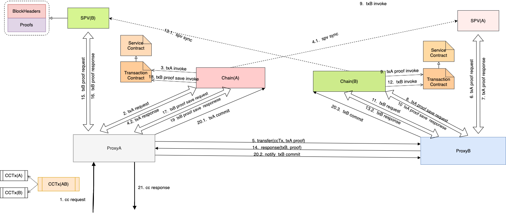
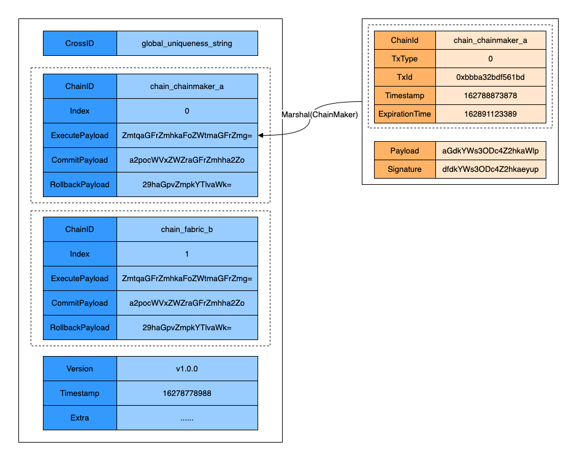
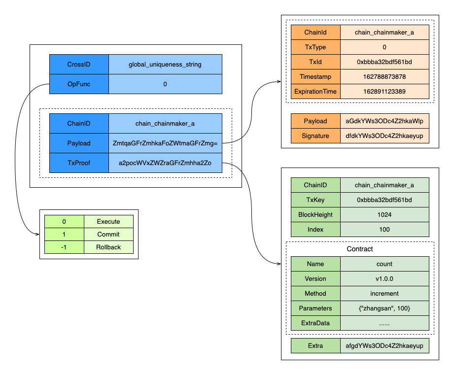
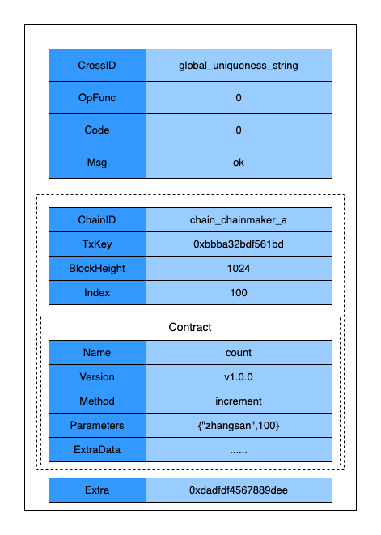

# 跨链方案
作者：长安链团队 邵珠光、刘京波、刘克猛

## 概述

什么是跨链？简单理解就是两条或多条链之间进行数据交换，以一个简单易懂的案例来说明，假设有两条链，其中一条链是招行（用户A在该银行中有存款），另外一条链是建行（用户B在该银行中有账户），如果用户A想将自己在招行的存款转账给用户B（建行），那么就需要进行跨链操作。

初版跨链采用网关的方案实现，该方案基于一个假设：在联盟链环境中，所有节点都是可信的，会存在异常节点，但不会存在恶意节点。为了解决可信性的问题，后续在新的版本中会采用Relay的方案。

> 温馨提示，跨链使用指南请参见：[跨链使用](../manage/跨链使用.md)

## 主要流程

为了能够兼容多种异构链，经过多方调研，本跨链方案采用正/逆向操作的合约实现方式，即用户需要提供正向与逆向的具体业务交易。还是以银行转账为例，对于用户A而言，其在整个跨链事务中的操作中对招行链的操作需要提供两个业务交易，第一个就是正常的存款减少交易，第二个则是逆向业务交易，即出现异常时的回滚操作，通常而言对应的是存款的增加。

跨链流程详细描述：

1. 业务系统调用跨链SDK发送CrossChainTx(CCTx)至ProxyA（跨链代理）；
2. ProxyA解析获取ChainA对应Execute交易，并发送至ChainA（TxA request）；
3. ChainA执行Execute交易（事务合约调用业务合约）；
4. ChainA上Execute交易（TxA）执行完成后；
    1. SPV(A)节点会实时同步ChainA的最新交易信息；
    2. 返回给ProxyA当前交易的执行结果；
5. ProxyA将应答转换为TxProof(TxA Proof)，并将CCTx及TxProof转发至ProxyB；
6. ProxyB调用SPV(A)的交易验证接口；
7. SPV(A)对该交易进行过验证，并返回验证应答结果；
8. 验证成功，ProxyB将TxA Proof发送到ChainB
9. ChainB执行Save存储TxA Proof(调用事务合约)
10. 返回给ProxyB SaveProof的执行结果
11. ProxyB解析并获取ChainB中对应的Execute交易，并发送至ChainB（TxB request）；
12. ChainB执行Execute交易（事务合约调用业务合约）；
13. ChainB上Execute交易（TxB）执行完成后：
    1. SPV(B)节点会实时同步ChainB的最新交易信息；
    2. 返回该交易应答至ProxyB；
14. ProxyB将应答转换为TxProof(TxB Proof)，并将TxProof发送至ProxyA；
15. ProxyA接收到TxBProof后调用SPV(B)的交易验证接口；
16. SPV(B)对该交易进行验证，并返回验证应答结果；
17. 验证成功，ProxyA将TxB Proof发送到ChainA
18. ChainA执行Save存储TxB Proof(调用事务合约)
19. 返回给ProxyA SaveProof的执行结果
20. ProxyA进行Commit调度：
    1. ProxyA提交ChainA的Commit交易（更新事务合约状态）至ChainA；
    2. ProxyA同时通知ChainB进行Commit操作；
    3. ProxyB解析接收到Commit消息，并提交ChainB的Commit交易（更新事务合约状态）至ChainB；
21. ProxyA汇总交易的执行情况，生成CCResponse，并返回至业务系统。

为了在一定程度上对跨链事务进行控制，本跨链方案中增加了事务合约的概念，用户的具体业务合约不会直接执行，而是通过事务合约进行调用，对于每一次跨链操作，系统会分配一个唯一的跨链ID，事务合约通过该ID对跨链的流程进行控制，防止重复执行的发生。

## 模块分层设计

跨链代理采用了模块化分层设计，主要分为三层：基础层、组件层和业务层。

+  基础层：为跨链代理各个组件提供基础服务，主要包括日志、数据库和网络处理等；
+ 组件层：提供业务流程调用的各种组件，包括但不限于通道、路由、监听器、证明器、适配器等；
+ 业务层：主要的业务流程控制，包括了多种Handler以及事务管理器。

## 数据流转

下面是整个数据流在跨链协议（包括内部模块）中基本的流转情况，在不同模块之间流转通过UITP协议。

## 事件详细分类

在跨链代理中，所有的数据流（包括直接传输和间接传输）都被称为Event（事件），下面是Event的详细分类。

## UITP协议

### 协议概述

UITP协议是跨链代理间数据交换的协议，它只是对主要数据结构的一种描述，不限制开发者使用何种传输方式。

### CrossEvent

CrossEvent即跨链事件，描述的是用户通过跨链SDK发送到跨链代理的数据对象。

`CrossEvent`数据结构

| 参数      | 说明                                         |
| --------- | -------------------------------------------- |
| CrossID   | 跨链ID，全局唯一，由跨链客户端产生           |
| CrossTxs  | 跨链交易集合，具体对象见表 `CrossTx`数据结构 |
| Version   | 协议版本号                                   |
| Timestamp | 跨链发生时间戳                               |
| Extra     | 自定义字段                                   |

`CrossTx`数据结构

| 参数            | 说明                                                  |
| --------------- | ----------------------------------------------------- |
| ChainID         | 业务链ID，在一个跨链系统中，ChainID唯一描述一条业务链 |
| Index           | 该交易对应的跨链操作索引，即链的执行顺序              |
| ExecutePayload  | 执行阶段内容载体                                      |
| CommitPayload   | 提交阶段内容载体                                      |
| RollbackPayload | 回滚阶段内容载体                                      |

### TransactionEvent

TransactionEvent即交易事件，描述的是两个跨链代理服务之间的消息传递。

`TransactionEvent`数据结构

| 参数    | 说明                                                         |
| ------- | ------------------------------------------------------------ |
| CrossID | 跨链ID，全局唯一，由跨链客户端产生                           |
| OpFunc  | 操作方法，即事务两个阶段中的某个操作，0：Execute；1：Commit；2：Rollback； |
| ChainID | 具体操作的业务链ID，在一个跨链系统中，ChainID唯一描述一条业务链 |
| Payload | 当前链操作的具体内容载体                                     |
| TxProof | 提交的交易证明，其中含有上个操作的信息，用于目的链校验，其具体结构参见 `TxProof`数据结构 |

`TxProof`数据结构

| 参数        | 说明                                                         |
| ----------- | ------------------------------------------------------------ |
| ChainID     | 具体操作的业务链ID，在一个跨链系统中，ChainID唯一描述一条业务链 |
| TxKey       | 交易Key，表示提供证明的交易其在链上的唯一性标识，例如ChainMaker中的TxId |
| BlockHeight | 交易所在区块高度                                             |
| Index       | 交易所在区块中的索引                                         |
| Contract    | 交易中所含有的合约相关信息，其具体结构见`Contract`数据结构   |

`Contract`数据结构

| 参数       | 说明                 |
| ---------- | -------------------- |
| Name       | 合约名称             |
| Version    | 调用合约的版本号信息 |
| Method     | 调用合约的具体方法名 |
| Parameters | 合约调用时的入参     |
| ExtraData  | 对该调用的额外信息   |

### CrossResp

CrossResp即跨链事件应答，是跨链代理完成后（也可以是异步）对客户端的应答结果。

`CrossResp`数据结构

| 参数       | 说明                                                         |
| ---------- | ------------------------------------------------------------ |
| CrossID    | 跨链ID，全局唯一，由跨链客户端产生                           |
| Code       | 本次跨链的最终结果，其具体描述如下：0：Success；1：Failure；2：Unknown；此种情况需要客户端再次主动查询 |
| Msg        | 本次跨链操作返回的信息，如果Code 为失败，则描述的是失败的原因。 |
| TxResponse | 交易应答集合，具体结构参考`TxResponse`数据结构               |

`TxResponse`数据结构

| 参数        | 说明                                                         |
| ----------- | ------------------------------------------------------------ |
| ChainID     | 具体操作的业务链ID，在一个跨链系统中，ChainID唯一描述一条业务链 |
| TxKey       | 交易Key，表示提供证明的交易其在链上的唯一性标识，例如ChainMaker中的TxId |
| BlockHeight | 交易所在区块高度                                             |
| Index       | 交易所在区块中的索引                                         |
| Extra       | 自定义字段                                                   |

### TransactionEventResp

TransactionEventResp即事务事件应答，是对TransactionEvent的应答。

`TransactionEventResp`数据结构

| 参数        | 说明                                                         |
| ----------- | ------------------------------------------------------------ |
| CrossID     | 跨链ID，全局唯一，由跨链客户端产生                           |
| OpFunc      | 操作方法，即事务两个阶段中的某个操作，0：Execute；1：Commit；2：Rollback； |
| Code        | 本次跨链的最终结果，其具体描述如下：0：Success；1：Failure；2：Unknown；此种情况需要客户端再次主动查询 |
| Msg         | 本次跨链操作返回的信息，如果Code 为失败，则描述的是失败的原因。 |
| ChainID     | 具体操作的业务链ID，在一个跨链系统中，ChainID唯一描述一条业务链 |
| TxKey       | 交易Key，表示提供证明的交易其在链上的唯一性标识，例如ChainMaker中的TxId |
| BlockHeight | 交易所在区块高度                                             |
| Index       | 交易所在区块中的索引                                         |
| Contract    | 合约信息的的载体，用于其他代理对该交易进行证明使用，其详细结构参见`Contract`数据结构 |
| Extra       | 自定义字段                                                   |

